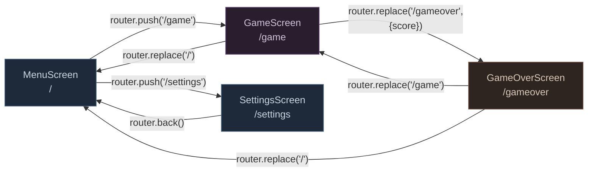
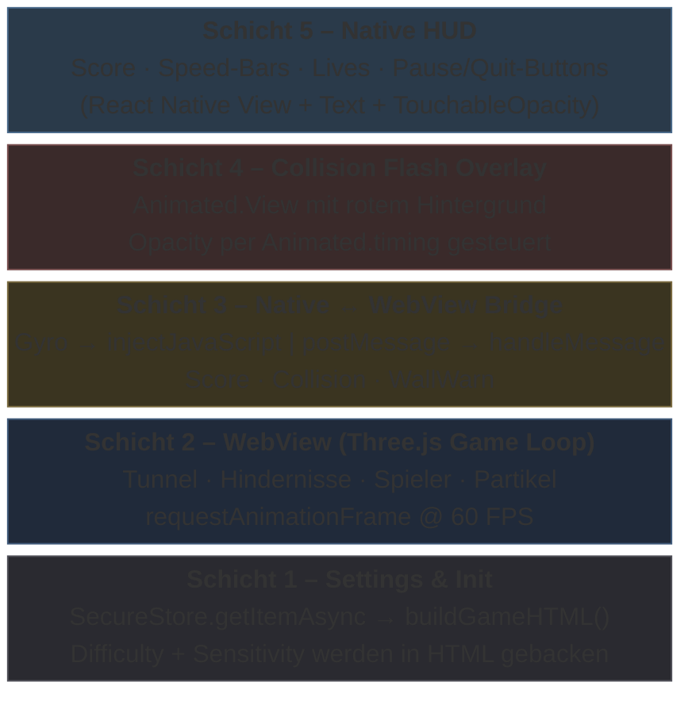
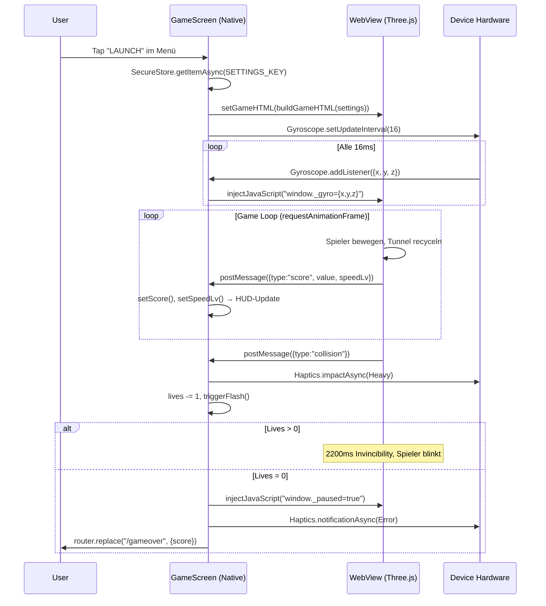

# Projekt- & Architekturdokumentation

**Tunnel Runner 3D** │ 
Modul: Mobile Anwendungen – SoSe 2026 │ 
Betreuer: Prof. Dr. Olaf Grebner │ 
Team: Mahmud Das (D867) & Alexander Savkov (D911) │
Version: 1.0.0
---
# 1 Anforderungen & Ziele

## 1.1 Themensteckbrief

| Feld                | Inhalt                                                                                                         |
| ------------------- | -------------------------------------------------------------------------------------------------------------- |
| **Projektname**     | **Tunnel Runner 3D**                                                                                           |
| **Paketname**       | `com.yourname.tunnelrunner3d` (Android) · npm: `tunnel-runner-3d`                                              |
| **Plattform**       | Android (primär), iOS (vorbereitet)                                                                            |
| **Framework**       | React Native 0.81.5 + Expo SDK 54 (Managed Workflow)                                                           |
| **Teamgröße**       | 2 Entwickler                                                                                                   |
| **Zeitbudget**      | 80 Stunden gesamt                                                                    |

### Problemstellung

Mobile Spiele im Endless-Runner-Genre setzen fast ausschließlich auf Touch-Steuerung (Wischen, Tippen). Das ist auf Dauer monoton und nutzt die Sensor-Hardware moderner Smartphones nicht aus. **Tunnel Runner 3D** löst dieses Problem, indem es die Steuerung vollständig auf das **Gyroskop** verlagert: Der Spieler navigiert eine leuchtende Kugel durch einen prozedural generierten 3D-Neon-Tunnel, indem er das Gerät physisch neigt. Dadurch entsteht ein immersives, körperliches Spielerlebnis, das sich deutlich von herkömmlichen Touch-Runnern abhebt.

### Zielgruppe

- **Casual Gamer** (16–35 Jahre), die kurze, intensive Spielsessions auf dem Smartphone suchen.
- **Retro- / Arcade-Fans**, die ein visuell ansprechendes Neon-Cyberpunk-Erlebnis mit steigendem Schwierigkeitsgrad schätzen.
- **Technik-affine Nutzer**, die Sensor-basierte Steuerung (Gyroskop + Haptik) gegenüber klassischen Touch-Controls bevorzugen.

### Kernfunktionalität (MVP – Alleinstellungsmerkmal)

Das Minimum Viable Product basiert auf drei Säulen:

1. **3D-Tunnel mit Hindernissen:** Ein endloser, prozedural generierter Tunnel mit Hindernis-Ringen, die jeweils eine zufällig platzierte Lücke besitzen. Durch Object-Pooling entsteht kein Speicher-Overhead bei unendlicher Laufzeit.
2. **Gyroskop-Steuerung:** Die Neigung des Geräts steuert die Spielerposition in Echtzeit. Die Sensitivität ist in vier Stufen konfigurierbar.
3. **Haptisches Feedback:** Drei abgestufte Vibrationsmuster (Wandnähe, Kollision, Game Over) geben dem Spieler physisches Feedback über seinen Spielzustand. Die Haptik ist abschaltbar.
4. 
---

## 1.2 Funktionale Anforderungen (Details)

### Muss-Kriterien

|  ID  | Anforderung                                 | Beschreibung                                                                                                                          |
| ---- | ------------------------------------------- | ------------------------------------------------------------------------------------------------------------------------------------- |
| F-01 | 3D-Tunnel-Rendering                         | Prozedural generierter Neon-Tunnel via Three.js, gerendert in einem Vollbild-WebView. Tunnel-Segmente werden endlos recycelt.          |
| F-02 | Hindernis-System                            | Hindernis-Ringe mit zufälliger Lückenposition. Lückenbreite variiert je nach gewähltem Schwierigkeitsgrad.                             |
| F-03 | Gyroskop-Steuerung                          | Echtzeitauswertung des Gyroskops mit konfigurierbarer Sensitivität. Neigung wird direkt auf die Spielerposition übertragen.            |
| F-04 | Kollisionserkennung                         | Kombination aus Distanz- und Winkel-Check gegen alle aktiven Hindernis-Ringe in der Nähe des Spielers.                                |
| F-05 | Leben-System                                | 3 Leben pro Spiel mit kurzer Unverwundbarkeits-Phase nach jeder Kollision. Bei 0 Leben endet das Spiel automatisch.                   |
| F-06 | Score-System mit Echtzeit-HUD               | Fortlaufender Score basierend auf zurückgelegter Distanz. HUD zeigt Score und aktuelle Geschwindigkeitsstufe (1–6).                    |
| F-07 | Haptisches Feedback                         | Drei Vibrationsstufen (Wandnähe, Kollision, Tod/Highscore). Über Settings global abschaltbar.                                         |
| F-08 | Screen-Navigation                           | Vier Screens (Menü, Spiel, Game Over, Settings) mit File-based Routing und screen-spezifischen Übergangsanimationen.                   |
| F-09 | Highscore-Persistenz                        | Lokale Speicherung des persönlichen Bestscores. Anzeige im Hauptmenü und auf dem Game-Over-Screen.                                     |
| F-10 | Settings                                    | Konfigurierbare Gyro-Sensitivität (4 Stufen), Schwierigkeitsgrad (3 Stufen), Haptics-Toggle und vollständiger Reset.                   |
| F-11 | Pause / Quit                                | Pause-Funktion während des Spiels. Quit mit Bestätigungs-Dialog, bei dem der aktuelle Spielstand verworfen wird.                       |
| F-12 | Grade-System                                | Buchstaben-Bewertung (S/A/B/C/D) auf dem Game-Over-Screen, basierend auf dem erreichten Score.                                         |

### Soll-Kriterien (geplant, perspektivisch)

| ID   | Feature                         | Perspektive                                                                                                                                       |
| ---- | ------------------------------- | ------------------------------------------------------------------------------------------------------------------------------------------------- |
| S-01 | Coin-System mit Sammelobjekten  | Nicht im aktuellen Release enthalten. Erfordert eigene Kollisionslogik, Partikeleffekte und Belohnungssystem. Perspektivisch Grundlage für ein Upgrade- und Freischalt-Modell. |
| S-02 | Erweiterte Hindernistypen       | Aktuell nur ein Typ (Ring mit Lücke). Geplant: rotierende Ringe, Wände, sich verengende Segmente. Voraussetzung: validiertes Balancing der Basismechanik. |
| S-03 | Power-Ups / Items               | Baut auf S-01 auf. Sobald ein Coin-System existiert, folgen sammelbare Items (Schild, Zeitlupe, Magnet) als Belohnungsmechanik.                    |
| S-04 | Wechselnde Tunnel-Abschnitte    | Farbwechsel, Texturvarianten und Umgebungswechsel sind vorgesehen. Zurückgestellt zugunsten einer stabilen Performance-Basis.                       |
| S-05 | Soundtrack & Soundeffekte       | Geplant: dynamischer Soundtrack, angepasst an die Geschwindigkeitsstufe, plus SFX für Kollisionen. Erfordert `expo-av`-Integration in einem kommenden Sprint. |

### Abgrenzung (explizit nicht umgesetzt)

| ID   | Feature                       | Begründung                                                                                                              |
| ---- | ----------------------------- | ----------------------------------------------------------------------------------------------------------------------- |
| A-01 | Mehrspieler / Online-Modus    | Ein Server-Backend hätte den Scope eines 40h-Projekts gesprengt. Der Fokus lag bewusst auf einer offline-fähigen App.    |
| A-02 | iOS-Veröffentlichung          | Ohne Apple Developer Account (99 $/Jahr) ist kein App-Store-Release möglich. Die Codebase ist aber iOS-kompatibel.       |
| A-03 | Cloud-Sync / User-Auth        | Authentifizierung und Datensynchronisation hätten ein MBaaS (Firebase o. Ä.) erfordert – unverhältnismäßig für ein Spiel mit rein lokalen Daten. |
| A-04 | Leaderboard / Social Features | Globale Ranglisten setzen A-01 und A-03 voraus. Ohne Backend kein sinnvolles Leaderboard.                                |

---

## 1.3 Nicht-funktionale Anforderungen & Qualitätsziele

| ID | Kategorie                      | Anforderung                                                                                                                                                         |
| ------ | ------------------------------ | ------------------------------------------------------------------------------------------------------------------------------------------------------------------- |
| NF-01  | **Usability**                  | Die App muss ohne Tutorial sofort spielbar sein. Die Steuerung erfolgt intuitiv durch Neigen des Geräts, keine Buttons während des Spiels. Eine „HOW TO PLAY"-Karte im Menü reicht als Erklärung. |
| NF-02  | **Visuelles Design**           | Konsistentes Neon-Cyberpunk-Theme über alle Screens hinweg (Dark Mode, einheitliche Farbpalette).                                  |
| NF-03  | **Performance**                | Stabile 60 FPS im Game Loop durch `requestAnimationFrame` mit Delta-Time-Normalisierung und begrenzter Pixel-Ratio. Architektur-Details → **Kapitel 3.4**.           |
| NF-04  | **Plattform-Kompatibilität**   | Primär Android. iOS-spezifische Anpassungen (Padding, Gyro-Permission) sind im Code berücksichtigt, sodass ein späterer iOS-Release ohne Code-Änderungen möglich wäre. |
| NF-05  | **Typsicherheit**              | TypeScript im Strict Mode mit typisierten Interfaces für alle Datenstrukturen. Details → **Kapitel 4.4**.                                                             |
| NF-06  | **Orientierung**               | Ausschließlich Portrait-Modus, da die Gyroskop-Achsenzuordnung (Neigen = Steuern) nur in einer festen Orientierung konsistent funktioniert.                          |
| NF-07  | **Barrierefreiheit (Haptik)**  | Haptisches Feedback ist vollständig abschaltbar, um Nutzer mit Sensibilitäten oder in ruhigen Umgebungen nicht einzuschränken.                                        |
| NF-08  | **Datensparsamkeit**           | Keine Netzwerk-Requests, keine Analytics, keine Tracker. Einzige externe Abhängigkeit zur Laufzeit ist das Three.js-CDN. Nur zwei lokale Schlüssel werden persistiert. |
| NF-09  | **Startzeit**                  | Sofortige Splash-Screen-Anzeige ohne asynchrones Asset-Loading, um die wahrgenommene Startzeit zu minimieren.                                                         |
| NF-10  | **Fehlertoleranz**             | Alle optionalen Hardware-Zugriffe (Haptics) sind mit Fallbacks abgesichert. Korrupte Settings werden durch Defaults ersetzt.                                          |

---

## 2 Tech Stack

### 2.1 Tech Stack Canvas

| Schicht | Technologie | Version | Zweck |
|---|---|---|---|
| **Framework** | Expo (Managed Workflow) | ^54.0.33 | App-Plattform, Build-System |
| **Sprache** | TypeScript | ~5.9.2 | Typsicherheit, Strict Mode |
| **UI-Framework** | React Native | 0.81.5 | Native UI-Komponenten |
| **Navigation** | expo-router | ~6.0.23 | File-based Routing |
| **3D-Engine** | Three.js (via WebView) | ^0.166.0 | 3D-Rendering des Tunnels |
| **WebView** | react-native-webview | 13.15.0 | Host für Three.js Game Loop |
| **Gyroskop** | expo-sensors | ~15.0.8 | Neigungssteuerung |
| **Haptik** | expo-haptics | ~15.0.8 | Vibrationsfeedback |
| **Persistenz** | AsyncStorage | 2.2.0 | Highscore & Settings |
| **Persistenz** | expo-secure-store | ~15.0.8 | Settings (alternative Nutzung) |
| **Splash** | expo-splash-screen | ~31.0.13 | Ladebildschirm |
| **Bundler** | Metro (Expo) | via `@expo/metro-runtime` | JS-Bundling |
| **Typen** | @types/react, @types/three | ~19.1.10, ^0.153.0 | TypeScript-Definitionen |

### 2.2 Architektur-Entscheidungen

<!-- TODO: Warum WebView statt expo-gl direkt? Warum kein expo-three? -->
<!-- Hinweis aus dem Code: "expo-three is NOT used. It's unmaintained and incompatible with SDK 55." -->
<!-- Stattdessen: Three.js läuft in einem WebView; Gyro-Daten werden per `injectJavaScript()` eingespeist. -->

---

# 3 Frontend: Struktur & Bausteine

## 3.1 Wesentliche Komponenten

Die gesamte Anwendung befindet sich im Verzeichnis `app/`. Expo-Router nutzt **File-based Routing** – jede Datei in `app/` entspricht einer Route. Die App besteht aus genau **5 TypeScript-Dateien**, die 4 Screens und 1 Layout ergeben:

```
app/
├── _layout.tsx      → Root-Layout (Stack-Navigator, Splash Screen, StatusBar)
├── index.tsx        → MenuScreen       (/)
├── game.tsx         → GameScreen       (/game)
├── gameover.tsx     → GameOverScreen   (/gameover)
└── settings.tsx     → SettingsScreen   (/settings)
```

| Datei            | Komponente         | Verantwortung                                                                 | LOC |
| ---------------- | ------------------ | ----------------------------------------------------------------------------- | --- |
| `_layout.tsx`    | `RootLayout`       | Stack-Navigator konfigurieren, Splash Screen steuern, StatusBar ausblenden    | 30  |
| `index.tsx`      | `MenuScreen`       | Titel-Animation, Highscore laden, „HOW TO PLAY"-Karte, Navigation zu Game/Settings | 140 |
| `game.tsx`       | `GameScreen`       | WebView mit Three.js-Spielwelt, Gyroskop-Bridge, HUD, Lives, Pause/Quit      | 557 |
| `gameover.tsx`   | `GameOverScreen`   | Score-Auswertung, Grade-Badge, Highscore-Persistenz, Replay/Menü-Navigation  | 173 |
| `settings.tsx`   | `SettingsScreen`   | Gyro-Sensitivity, Difficulty, Haptics-Toggle, Reset-All                       | 223 |

Zusätzlich definieren die Screens **wiederverwendbare Sub-Komponenten**:

| Sub-Komponente | Definiert in      | Zweck                                                    |
| -------------- | ----------------- | -------------------------------------------------------- |
| `InfoRow`      | `index.tsx`       | Icon + Text-Zeile für die „HOW TO PLAY"-Anleitung        |
| `StatBox`      | `gameover.tsx`    | Kennzahl-Karte (z. B. Distanz, Speed-Level)              |
| `Section`      | `settings.tsx`    | Gruppierung mit Titel + Subtitle für Settings-Bereiche   |

---

## 3.2 Komponenten-Details & Interaktion

### Screen-Flow

Der User-Flow ist **streng linear**. Es gibt keinen globalen State, der zwischen Screens geteilt wird. Jeder Screen lädt seine Daten selbständig aus AsyncStorage. Die einzige Datenübergabe zwischen Screens geschieht über **URL-Parameter** (Score von Game → GameOver).



### Datenfluss zwischen Screens

| Von → Nach           | Transportmechanismus                          | Daten                        |
| -------------------- | --------------------------------------------- | ---------------------------- |
| Menu → Game          | `router.push('/game')` (keine Parameter)      | –                            |
| Menu → Settings      | `router.push('/settings')` (keine Parameter)  | –                            |
| Game → GameOver      | `router.replace({pathname, params: {score}})` | Finaler Score als String     |
| GameOver → Game      | `router.replace('/game')` (keine Parameter)   | –                            |
| GameOver → Menu      | `router.replace('/')` (keine Parameter)       | –                            |
| Settings → Menu      | `router.back()` (Stack-Pop)                   | –                            |

**Wichtig:** Es existiert kein React Context, kein Redux, kein Zustand. Die Screens sind vollständig entkoppelt. Persistierte Daten (Highscore, Settings) werden von jedem Screen eigenständig aus AsyncStorage gelesen.

---

## 3.3 (UI-)Komponenten-Aufbau

### Design-System

Die App nutzt kein UI-Framework (kein NativeBase, kein Tamagui). Alle Styles sind handgeschrieben mit `StyleSheet.create()`. Ein konsistentes Neon-Cyberpunk-Theme zieht sich durch alle Screens:

| Farbe         | Hex         | Verwendung                                          |
| ------------- | ----------- | --------------------------------------------------- |
| Deep Black    | `#000011`   | Hintergrund aller Screens                           |
| Neon Cyan     | `#00ffff`   | Akzentfarbe, Buttons, HUD, aktive Elemente          |
| Muted Blue    | `#445566`   | Labels, Subtitles, inaktive Elemente                |
| Neon Red      | `#ff2244`   | Game Over, Kollisions-Flash, Danger Zone            |
| Gold          | `#ffaa00`   | Highscore, Personal Best                            |
| Card BG       | `rgba(0,6,30,0.92)` | Halbtransparente Kartenhintergründe          |

### Gemeinsame UI-Patterns

Alle Screens folgen demselben Aufbau-Muster:

1. **Root-Container** (`flex: 1, backgroundColor: '#000011'`) als Vollbild-Hintergrund
2. **Card-Container** mit 1px-Border in `rgba(0,255,255,0.14)`, abgerundeten Ecken und halbtransparentem Hintergrund
3. **Buttons** in zwei Varianten:
   - **Primary**: Cyan-Border + leichter Cyan-Hintergrund, Text in `#00ffff` mit Glow-Shadow
   - **Secondary**: Dezenter Border, Text in `#445566`
4. **Animationen**: Jeder Screen nutzt `Animated` von React Native für Eingangsanimationen (Spring, Timing, Sequence). Keine externe Animations-Library.

### Sub-Komponente im Detail: `Section` (settings.tsx)

Die `Section`-Komponente demonstriert das Kompositionsprinzip der App. Sie kapselt ein visuelles Gruppen-Pattern, das im Settings-Screen viermal verwendet wird:

```tsx
const Section = ({ title, subtitle, children }) => (
  <View style={s.section}>            // Card mit Border
    <Text style={s.sectionTitle}>      // Cyan, uppercase, letter-spacing
      {title}
    </Text>
    <Text style={s.sectionSub}>        // Muted, kleine Schrift
      {subtitle}
    </Text>
    <View style={s.sectionBody}>       // Flexible Kinder-Slots
      {children}
    </View>
  </View>
);
```

Dieses Pattern wird für **Gyroscope Sensitivity**, **Difficulty**, **Haptic Feedback** und **Danger Zone** wiederverwendet. Die `children`-Prop macht die Komponente flexibel: Sie nimmt Segmented Controls, Radio-Buttons, Switches oder Buttons gleichermaßen auf.

---

## 3.4 Bausteinsicht: `GameScreen` – das Herzstück

Der `GameScreen` (`app/game.tsx`, 557 Zeilen) ist die mit Abstand komplexeste Komponente. Er verbindet eine native React-Native-Oberfläche mit einer vollständigen Three.js-3D-Welt, die in einer WebView läuft. Diese Hybrid-Architektur ist die zentrale technische Entscheidung des Projekts.

### Warum WebView statt expo-gl?

`expo-gl` und `expo-three` sind zwar als Dependencies installiert, werden aber **nicht verwendet**. Grund: `expo-gl` erfordert einen nativen Build (Development Build / EAS Build). Das Projekt sollte aber vollständig in **Expo Go** lauffähig sein, ohne dass die Entwickler einen Apple Developer Account oder Android-Signing konfigurieren müssen. Die WebView-Lösung lädt Three.js von einem CDN und funktioniert out-of-the-box.

### 5-Schichten-Architektur

Der GameScreen besteht aus fünf logischen Schichten, die vertikal gestapelt sind:



### Schicht 1 – Settings & Initialisierung

Beim Mount liest der GameScreen die User-Settings aus `SecureStore`:

```tsx
useEffect(() => {
  SecureStore.getItemAsync(SETTINGS_KEY).then(v => {
    // Settings parsen, Defaults anwenden, HTML generieren
    setGameHTML(buildGameHTML(settingsRef.current));
  });
}, []);
```

Die Funktion `buildGameHTML()` erzeugt einen kompletten HTML-String mit eingebettetem JavaScript. Difficulty und Sensitivity werden als Variablen direkt in den HTML-String interpoliert – sie sind zur Laufzeit der WebView unveränderlich. Dadurch braucht die WebView keine weitere Konfiguration nach dem Laden.

### Schicht 2 – Three.js Game Loop

Innerhalb der WebView läuft eine vollständige Three.js-Szene:

- **Renderer**: `WebGLRenderer` mit Antialiasing, Pixel-Ratio begrenzt auf 2
- **Szene**: Fog (`FogExp2`) erzeugt Tiefenwahrnehmung
- **Kamera**: `PerspectiveCamera` (FOV 78°), bewegt sich kontinuierlich in negativer Z-Richtung
- **Beleuchtung**: AmbientLight + 2 PointLights (Cyan-Fill + Magenta-Rim), an die Kamera angehängt
- **Spieler**: Cyan-Kugel (`SphereGeometry`) mit Glow-Halo und rotierendem Trail-Ring
- **Tunnel**: 3 `CylinderGeometry`-Segmente (je 90 Einheiten) mit 10 farbigen Neon-Streifen und Torus-Ringen als Dekor-Elemente
- **Hindernisse**: 18 Ringe (`buildRing()`), bestehend aus ~24 Boxen in einem Kreis mit einer zufällig rotierten Lücke
- **Partikel**: 300 `Points` im Tunnel verteilt für Tiefenwirkung

Der Game Loop nutzt `requestAnimationFrame` mit Delta-Time-Normalisierung:

```javascript
var dt = clamp((now - last) / 16.67, 0.1, 4);
```

Dies stellt sicher, dass die Spielgeschwindigkeit unabhängig von der Framerate bleibt. Bei 60 FPS ist `dt ≈ 1.0`, bei Frame-Drops wird proportional kompensiert.

### Schicht 3 – Native ↔ WebView Bridge

Die Kommunikation zwischen den beiden Welten (Native React Native und WebView-JavaScript) läuft über zwei Kanäle:

**Native → WebView** (via `injectJavaScript`):

| Daten          | Code                                                | Frequenz      |
| -------------- | --------------------------------------------------- | ------------- |
| Gyroscope-Werte | `window._gyro={x:${d.x},y:${d.y},z:${d.z}}`      | Alle 16 ms    |
| Pause-Zustand  | `window._paused=${boolean}`                         | Bei User-Input|

**WebView → Native** (via `postMessage` → `onMessage`):

| Event-Typ    | Payload                      | Auslöser                             |
| ------------ | ---------------------------- | ------------------------------------ |
| `score`      | `{value, speedLv}`           | Alle 100 ms aus dem Game Loop        |
| `collision`  | `{score}`                    | Bei Kollision mit Hindernis-Ring     |
| `wallwarn`   | `{}`                         | Spieler > 88% Offset zur Wand       |

### Schicht 4 – Collision Flash

Ein halbtransparentes `Animated.View`-Overlay wird bei jeder Kollision kurz rot eingeblendet (55 ms auf volle Opazität, 230 ms Fade-Out). Das gibt dem Spieler visuelles Feedback zusätzlich zur Haptik.

### Schicht 5 – Native HUD

Das HUD ist ein absolut positioniertes `View` über der WebView. Es zeigt:

- **Score**: 6-stellig, zero-padded, Cyan mit Glow-Shadow
- **Speed**: 6 farbige Bars (grün → rot), gefüllt je nach `speedLv`
- **Lives**: 3 Herz-Emojis, ausgegraute Herzen bei Verlust
- **Pause/Quit**: Zwei runde Buttons (⏸ / ✕)

Das HUD nutzt `pointerEvents="box-none"`, damit Touch-Events durch das HUD hindurch an die WebView gelangen.

---

## 3.5 Komponenten-Interaktion

Das folgende Sequenzdiagramm zeigt einen typischen Spielzyklus – vom Start bis zur Kollision:



---

## 3.6 Modularisierung

### Aufteilung der fachlichen Logik auf Dateien

| Concern                  | Datei(en)                   | Beschreibung                                            |
| ------------------------ | --------------------------- | ------------------------------------------------------- |
| Navigation & Layout      | `_layout.tsx`               | Stack-Konfiguration, Animations, Splash Screen          |
| Menü & Einstieg          | `index.tsx`                 | Titel-Animation, Highscore-Anzeige, „HOW TO PLAY"      |
| Spiellogik (3D)          | `game.tsx` (inline HTML/JS) | Tunnel, Hindernisse, Kollision, Game Loop                |
| Spiellogik (Native)      | `game.tsx` (React-Teil)     | HUD, Lives, Haptics, Pause, WebView-Bridge              |
| Auswertung               | `gameover.tsx`              | Score-Anzeige, Grade, Highscore-Update                  |
| Konfiguration            | `settings.tsx`              | UI für Sensitivity, Difficulty, Haptics; Persistenz     |
| Typ-Definitionen         | `settings.tsx` (Export)     | `GameSettings`, `DEFAULT_SETTINGS`, `SETTINGS_KEY`      |
| Highscore-Key            | `index.tsx` (Export)        | `HS_KEY` – von `gameover.tsx` und `settings.tsx` importiert |

### Geteilte Exporte

Die Screens teilen sich nur **vier Named Exports**:

```
index.tsx       → export const HS_KEY
settings.tsx    → export const SETTINGS_KEY
settings.tsx    → export const DEFAULT_SETTINGS
settings.tsx    → export type  GameSettings
```

Diese werden in `game.tsx` und `gameover.tsx` importiert. Es gibt keine zirkulären Abhängigkeiten.

---

## 3.7 State Management

### Bewusste Entscheidung: Kein globaler State Manager

Die App nutzt **keinen** globalen State Manager (kein Redux, kein Zustand, kein React Context). Die Begründung ist pragmatisch:

- Nur 4 Screens, die **nie gleichzeitig gemounted** sind
- Keine shared Daten, die synchron zwischen Screens gehalten werden müssen
- Persistierte Daten (Highscore, Settings) werden bei jedem Screen-Mount frisch aus AsyncStorage gelesen

### State pro Screen

Jeder Screen verwaltet seinen State lokal mit `useState` und `useRef`:

| Screen         | useState (reaktiv, löst Re-Render aus)                      | useRef (nicht-reaktiv, für Performance)                          |
| -------------- | ----------------------------------------------------------- | ---------------------------------------------------------------- |
| `MenuScreen`   | `highScore`                                                 | `titleY`, `titleOp`, `cardOp`, `pulseAnim` (Animationen)        |
| `GameScreen`   | `score`, `lives`, `speedLv`, `paused`, `gameHTML`           | `livesRef`, `gsRef`, `scoreRef`, `webviewRef`, `settingsRef`, `flashAnim` |
| `GameOverScreen` | `highScore`, `isNewHigh`                                  | `titleScale`, `titleOp`, `scoreY`, `scoreOp`, `btnsOp`, `badgeScale` |
| `SettingsScreen` | `settings` (das gesamte GameSettings-Objekt)              | –                                                                |

### WebView-interner State

Innerhalb der WebView existiert ein zweiter, vollständig getrennter State:

| Variable       | Typ       | Beschreibung                                              |
| -------------- | --------- | --------------------------------------------------------- |
| `window._gyro` | `{x,y,z}` | Gyro-Daten, von außen per `injectJavaScript` geschrieben |
| `window._paused` | `boolean` | Pause-Zustand, von außen gesteuert                      |
| `px`, `py`     | `number`  | Spielerposition (berechnet aus Gyro × Sensitivity × dt)   |
| `speed`        | `number`  | Aktuelle Geschwindigkeit, berechnet aus Score             |
| `score`        | `number`  | Spielstand, berechnet aus zurückgelegter Distanz          |
| `zProg`        | `number`  | Gesamte zurückgelegte Z-Distanz                           |
| `invinc`       | `boolean` | Unverwundbarkeits-Flag nach Kollision                     |

---

## 3.8 Routing

### expo-router: File-based Routing

Expo-Router leitet die Routen automatisch aus der Dateistruktur ab. Die Datei `app/_layout.tsx` definiert einen `Stack`-Navigator als Root:

```tsx
<Stack screenOptions={{ headerShown: false, animation: 'fade', contentStyle: { backgroundColor: '#000011' } }}>
  <Stack.Screen name="index" />
  <Stack.Screen name="game"     options={{ animation: 'none' }} />
  <Stack.Screen name="gameover" options={{ animation: 'slide_from_bottom' }} />
  <Stack.Screen name="settings" options={{ animation: 'slide_from_right' }} />
</Stack>
```

| Route        | Datei            | Animation             | Navigationsmethode                                     |
| ------------ | ---------------- | --------------------- | ------------------------------------------------------ |
| `/`          | `index.tsx`      | `fade` (default)      | Startscreen                                            |
| `/game`      | `game.tsx`       | `none`                | `router.push('/game')` – sofortiger Übergang           |
| `/gameover`  | `gameover.tsx`   | `slide_from_bottom`   | `router.replace({pathname, params})` – kein Back-Stack |
| `/settings`  | `settings.tsx`   | `slide_from_right`    | `router.push('/settings')` – Back-Button möglich       |

**`router.push()` vs. `router.replace()`:**

- **push**: Fügt einen Screen auf den Stack. Der User kann per Back-Geste zurück. Genutzt für Menu → Game und Menu → Settings.
- **replace**: Ersetzt den aktuellen Screen im Stack. Kein Zurück möglich. Genutzt für Game → GameOver (der User soll nicht zurück ins laufende Spiel navigieren) und GameOver → Menu/Game.

---

## 3.9 Persistenz

### Was wird wo gespeichert?

Die App nutzt zwei Storage-Mechanismen:

| Daten       | Storage-Typ    | Key                      | Schreiben                    | Lesen                              |
| ----------- | -------------- | ------------------------ | ---------------------------- | ---------------------------------- |
| Highscore   | AsyncStorage   | `tunnel_highscore_v3`    | `gameover.tsx` (bei neuem HS)| `index.tsx`, `gameover.tsx`         |
| Settings    | AsyncStorage   | `tunnel_settings_v3`     | `settings.tsx` (bei Änderung)| `settings.tsx`, `game.tsx`*         |

*\*`game.tsx` liest die Settings über `SecureStore.getItemAsync()` – das ist eine Inkonsistenz (Settings werden in AsyncStorage geschrieben, aber über SecureStore gelesen). SecureStore bietet verschlüsselten Zugriff, was für die Settings nicht zwingend nötig wäre. Beide Libraries lösen aber unter demselben Key auf, da `expo-secure-store` auf Android intern auf `SharedPreferences` zurückfällt.*

### Datenformat

Settings werden als JSON-String gespeichert:

```json
{
  "gyroSensitivity": 0.11,
  "hapticsEnabled": true,
  "difficulty": "normal"
}
```

Der Highscore wird als einfacher numerischer String gespeichert (z. B. `"2847"`).

### Reset

Der Settings-Screen bietet eine „RESET ALL DATA"-Funktion:

```tsx
await AsyncStorage.multiRemove([SETTINGS_KEY, HS_KEY]);
```

Diese löscht **beide** Keys in einem Aufruf – sowohl Settings als auch Highscore werden auf Defaults zurückgesetzt.

---

## 3.10 Konfiguration

### `app.json` – Expo-Konfiguration

| Einstellung              | Wert                                      | Zweck                                    |
| ------------------------ | ----------------------------------------- | ---------------------------------------- |
| `orientation`            | `"portrait"`                              | Landscape gesperrt (Gyro-Achsen-Konsistenz) |
| `userInterfaceStyle`     | `"dark"`                                  | Erzwingt Dark Mode systemweit            |
| `scheme`                 | `"tunnelrunner"`                          | Deep-Link-Schema für expo-router         |
| `android.permissions`    | `["VIBRATE"]`                             | Berechtigung für Haptic Feedback         |
| `ios.infoPlist`          | `NSMotionUsageDescription`                | iOS-Gyroskop-Berechtigung mit Begründung |
| `plugins`                | `expo-router`, `expo-sensors`, `expo-font`, `expo-secure-store`, `expo-asset` | Expo-Plugin-Pipeline |

### `tsconfig.json` – TypeScript

| Einstellung        | Wert                | Zweck                                         |
| ------------------ | ------------------- | --------------------------------------------- |
| `extends`          | `expo/tsconfig.base`| Expo-Defaults als Basis                       |
| `strict`           | `true`              | Alle strengen Prüfungen aktiviert             |
| `paths.@/*`        | `["./*"]`           | Pfad-Alias für Root-Imports (`@/app/...`)     |

### `metro.config.js` – Bundler

```javascript
config.resolver.sourceExts = [...config.resolver.sourceExts, 'cjs'];
config.resolver.unstable_enablePackageExports = false;
```

Die `.cjs`-Extension wird hinzugefügt, weil Three.js (als npm-Dependency installiert, auch wenn es per CDN geladen wird) CommonJS-Module enthält, die Metro sonst nicht auflöst. `unstable_enablePackageExports` wird deaktiviert, um Konflikte mit Three.js' `exports`-Feld in `package.json` zu vermeiden.

---

## 3.11 Implementierung der Fachlogik

Die gesamte Spielmechanik läuft innerhalb des `buildGameHTML()`-Strings in der WebView. Die folgenden Mechaniken bilden den Kern:

### Tunnel (Object Pooling)

Drei Zylinder-Segmente von je 90 Einheiten Länge werden vorab erzeugt und hintereinander platziert. Sobald ein Segment hinter der Kamera liegt (Z > camZ + 12), wird es an das hintere Ende verschoben:

```javascript
var minZ = segments.reduce((m, s) => Math.min(m, s.position.z), Infinity);
seg.position.z = minZ - SEGMENT_LENGTH;
```

Dadurch entsteht ein endloser Tunnel ohne neue Objekt-Allokation. Dasselbe Prinzip gilt für die 18 Hindernis-Ringe.

### Hindernisse (Difficulty-abhängig)

Jeder Ring besteht aus ~24 Box-Geometrien, die kreisförmig angeordnet sind. Eine Lücke wird durch Auslassen von Segmenten erzeugt. Die Lückenbreite variiert pro Schwierigkeitsgrad:

| Difficulty | `gapAngle`    | `maxSpeed` | `speedScale` |
| ---------- | ------------- | ---------- | ------------ |
| Easy       | 0.56π (~101°) | 0.22       | 0.00009      |
| Normal     | 0.48π (~86°)  | 0.32       | 0.00012      |
| Hard       | 0.38π (~68°)  | 0.42       | 0.00016      |

### Kollisionserkennung

Die Kollision wird in zwei Schritten geprüft:

1. **Distanz-Check**: Ist der Spieler nahe genug am Tunnelrand? (`√(px² + py²) > TUNNEL_RADIUS × 0.40`)
2. **Winkel-Check**: Befindet sich der Spieler außerhalb der Lücke? (`|normAngle(atan2(py,px) − gapAngle)| > gapAngle/2`)

Nur wenn beide Bedingungen erfüllt sind und der Spieler sich in Z-Nähe (< 0.75 Einheiten) eines Rings befindet, wird eine Kollision ausgelöst.

### Geschwindigkeitseskalation

Die Geschwindigkeit steigt linear mit dem Score, ist aber je Difficulty gedeckelt:

```javascript
speed = clamp(INITIAL_SPEED + score * cfg.speedScale, INITIAL_SPEED, cfg.maxSpeed);
```

Bei `INITIAL_SPEED = 0.055` und Normal-Difficulty erreicht der Spieler die Maximalgeschwindigkeit (0.32) bei ca. Score 2200. Der `speedLv` (1–6) wird als visuelles Feedback an das HUD gesendet.

### Lives & Invincibility

Der Spieler startet mit 3 Leben. Nach jeder Kollision:

1. `invinc = true` für 2200 ms (Spieler blinkt im 110-ms-Takt)
2. `postMessage({type:'collision'})` → Native Layer dekrementiert `livesRef`
3. Bei `livesRef.current <= 0`: Game Loop wird pausiert, Navigation zu `/gameover`

> Die perspektivisch geplanten Erweiterungen (Coins, Power-Ups, erweiterte Hindernistypen) sind in Kapitel 1.2, Tabelle „Soll-Kriterien", dokumentiert.

---

## 4 Tooling

### 4.1 Scripts in `package.json`

| Script | Befehl | Beschreibung |
|---|---|---|
| `start` | `expo start` | Dev Server starten (QR-Code für Expo Go) |
| `start:clear` | `expo start --clear` | Dev Server mit Cache-Clear |
| `android` | `expo start --android` | Direkt auf Android-Emulator/Device starten |
| `ios` | `expo start --ios` | Direkt auf iOS-Simulator starten |

### 4.2 Package Management

| Aspekt | Wert |
|---|---|
| Package Manager | **npm** |
| Lock-Datei | `package-lock.json` |
| Dependencies (prod) | 23 |
| Dependencies (dev) | 4 |
| Privat | `true` (nicht veröffentlichbar) |

### 4.3 Linter & Formatter

<!-- TODO: Beschreibe den Stand -->
<!-- Aktueller Stand: Kein ESLint, kein Prettier, kein JSDoc-Enforcement konfiguriert.
     Empfehlung: eslint-config-expo + prettier + require-jsdoc Rule -->

### 4.4 TypeScript-Konfiguration

| Option | Wert | Auswirkung |
|---|---|---|
| `extends` | `expo/tsconfig.base` | Expo-Standard-Einstellungen |
| `strict` | `true` | Strikte Typisierung |
| `paths` | `@/* → ./*` | Saubere Import-Pfade |
| `include` | `**/*.ts`, `**/*.tsx`, `.expo/types/**/*.d.ts` | Alle TS/TSX-Dateien |

### 4.5 Dev Build

<!-- TODO: Beschreibe den Entwicklungs-Workflow -->
<!-- `npm start` → Metro Bundler → Expo Go App auf physischem Gerät (QR-Code scannen) -->
<!-- Gyroskop funktioniert NICHT im Emulator → physisches Device erforderlich -->

### 4.6 Production Build

<!-- TODO: Beschreibe den Prod-Build-Prozess -->
<!-- `eas build --platform android` (Expo Application Services) -->
<!-- Aktuell: Kein EAS-Config im Repo vorhanden -->

### 4.7 Deployment

<!-- TODO: Beschreibe die Deployment-Strategie -->
<!-- Aktuell: Nur lokale Entwicklung via Expo Go -->
<!-- Kein App Store / Play Store Release konfiguriert -->

---

## 5 Qualität

### 5.1 Test-Setup

<!-- TODO: Beschreibe vorhandene Tests -->
<!-- Aktueller Stand: Keine Unit-Tests, keine E2E-Tests im Repository vorhanden.
     Kein Jest-Config, kein Detox/Maestro Setup.
     Empfehlung: Jest + React Native Testing Library für Komponentenlogik -->

### 5.2 CI/CD-Pipeline

<!-- TODO: Beschreibe die CI/CD-Pipeline -->
<!-- Aktueller Stand: Kein `.github/workflows/`-Verzeichnis vorhanden.
     Keine GitHub Actions konfiguriert.
     Empfehlung: Lint + Type-Check + Build Workflow -->

---

## 6 Quellcode-Übersicht

### Dateistruktur & Kennzahlen

| Datei | Typ | Zeilen (ca.) | Beschreibung |
|---|---|---|---|
| `app/_layout.tsx` | TSX | ~30 | Root Layout mit Stack-Navigation |
| `app/index.tsx` | TSX | ~140 | Hauptmenü mit Animationen |
| `app/game.tsx` | TSX | ~557 | Spiellogik (WebView + Native HUD) |
| `app/gameover.tsx` | TSX | ~173 | Game-Over-Screen mit Grading |
| `app/settings.tsx` | TSX | ~223 | Einstellungs-Screen |
| `metro.config.js` | JS | ~9 | Metro-Bundler-Konfiguration |
| `app.json` | JSON | ~38 | Expo-App-Konfiguration |
| `package.json` | JSON | ~44 | Dependencies & Scripts |
| `tsconfig.json` | JSON | ~16 | TypeScript-Konfiguration |
| `PLANUNG` | Text | ~14 | Aufgabenverteilung |

| Kennzahl | Wert |
|---|---|
| **Gesamte Quelldateien (app/)** | 5 TSX-Dateien |
| **Geschätzter TS/TSX-Code** | ~1.120 Zeilen |
| **Commits (master)** | 9 |
| **Branches** | 4 (`master`, `main`, `Dev`, `dev`) |
| **Contributers** | 2 (Mahmo47, Alex) |
| **Zeitraum** | 04.02.2026 – 22.03.2026 |

---

## 7 Projektbericht

### 7.1 Kapazitätsplan (Plan vs. Ist)

| Arbeitspaket | Verantwortlich | Plan (h) | Ist (h) | Abweichung |
|---|---|---|---|---|
| Projektsetup & Expo Init | Mahmud | <!-- TODO --> | <!-- TODO --> | <!-- TODO --> |
| 3D-Tunnel-Rendering (Three.js) | Alex | <!-- TODO --> | <!-- TODO --> | <!-- TODO --> |
| Gyroskop-Steuerung | Alex | <!-- TODO --> | <!-- TODO --> | <!-- TODO --> |
| Kollisionserkennung & Lives | Alex | <!-- TODO --> | <!-- TODO --> | <!-- TODO --> |
| HUD & Game-Over-Screen | Mahmud | <!-- TODO --> | <!-- TODO --> | <!-- TODO --> |
| Settings-Screen | Mahmud & Alex | <!-- TODO --> | <!-- TODO --> | <!-- TODO --> |
| Haptics & Vibration | Mahmud | <!-- TODO --> | <!-- TODO --> | <!-- TODO --> |
| Highscore-Persistenz | Mahmud & Alex | <!-- TODO --> | <!-- TODO --> | <!-- TODO --> |
| Coin-System | Alex | <!-- TODO --> | <!-- TODO --> | <!-- TODO --> |
| Soundtrack & SFX | Mahmud | <!-- TODO --> | <!-- TODO --> | <!-- TODO --> |
| Dokumentation & Präsentation | Mahmud & Alex | <!-- TODO --> | <!-- TODO --> | <!-- TODO --> |
| **Summe** | | **40** | <!-- TODO --> | <!-- TODO --> |

### 7.2 Lessons Learned

**1. WebView-Architektur als Workaround für `expo-three`-Inkompatibilität**
<!-- TODO: Ausformulieren -->
<!-- Das ursprüngliche Setup nutzte @react-three/fiber + expo-three direkt.
     Diese Libraries waren inkompatibel mit Expo SDK 54/55.
     Die Migration zu einem WebView-basierten Ansatz (Three.js via CDN im HTML-String)
     war aufwändig, ermöglichte aber den Betrieb in Expo Go ohne nativen Build.
     Lesson: Vor Projektstart Kompatibilität aller Core-Dependencies prüfen. -->

**2. Inkonsistente Dependency-Versionen zwischen Branches**
<!-- TODO: Ausformulieren -->
<!-- Im dev-Branch wurden SDK-55-Versionen genutzt, auf master mussten diese
     zurück auf SDK-54-kompatible Versionen gedowngraded werden (Commit b962a69).
     Das führte zu einem großen package-lock.json Diff und Zeitverlust.
     Lesson: Dependency-Upgrades nur in einem dedizierten Branch durchführen,
     nach erfolgreichem Build mergen. -->

**3. Fehlender Game-Over-Screen als kritischer Bug kurz vor Deadline**
<!-- TODO: Ausformulieren -->
<!-- Der letzte Commit (b962a69) hieß "Fixed version fehlender gameover" –
     ein essentielles Feature (F-03) funktionierte bis kurz vor Abgabe nicht korrekt,
     weil die Dependency-Versionen im package.json nicht zum Code passten.
     Lesson: Feature-Vollständigkeit frühzeitig auf einem stabilen Branch sicherstellen;
     Version-Pinning statt Semver-Ranges für kritische Packages. -->

---
