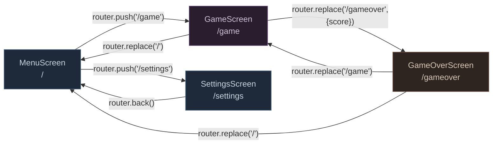
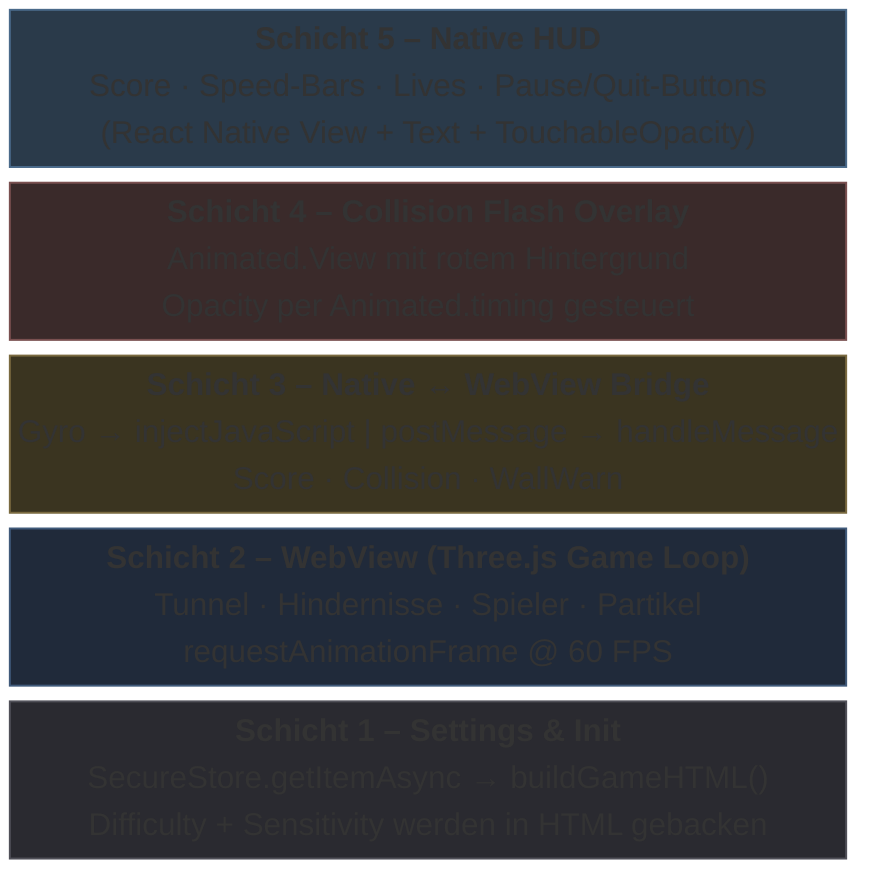
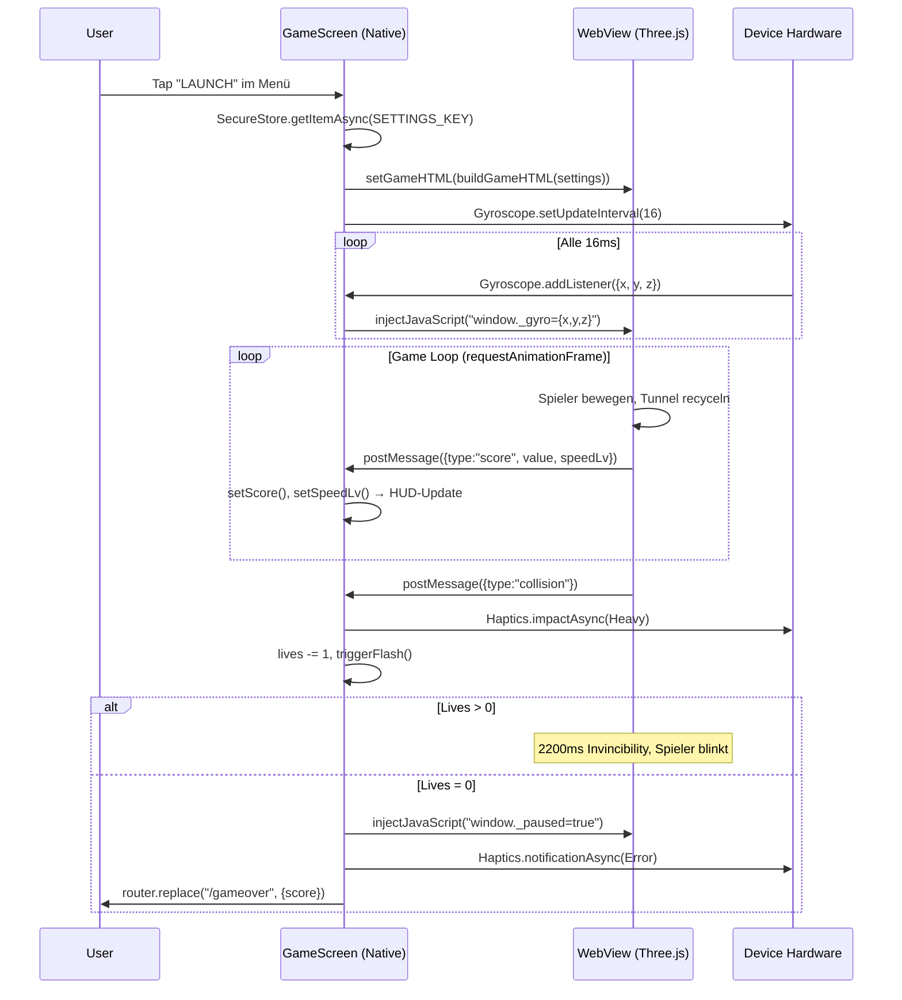
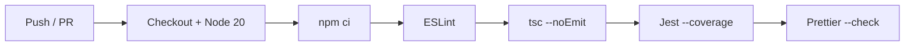

# Projekt- & Architekturdokumentation

**Tunnel Runner 3D** │ 
Modul: Mobile Anwendungen – WiSe 2025/26 │ 
Betreuer: Prof. Dr. Olaf Grebner │ 
Team: Mahmud Das (D867) & Alexander Savkov (D911) │
Version: 1.0.0

# 1 Anforderungen & Ziele

## 1.1 Themensteckbrief

| Feld                | Inhalt                                                                                                         |
| ------------------- | -------------------------------------------------------------------------------------------------------------- |
| **Projektname**     | **Tunnel Runner 3D**                                                                                           |
| **Paketname**       | `com.yourname.tunnelrunner3d` (Android) · npm: `tunnel-runner-3d`                                              |
| **Plattform**       | Android (primär), iOS (vorbereitet)                                                                            |
| **Framework**       | React Native 0.81.5 + Expo SDK 54 (Managed Workflow)                                                           |
| **Teamgröße**       | 2 Entwickler                                                                                                   |
| **Zeitbudget**      | 80 Stunden gesamt                                                                    |

### Problemstellung

Mobile Spiele im Endless-Runner-Genre setzen fast ausschließlich auf Touch-Steuerung (Wischen, Tippen). Das ist auf Dauer monoton und nutzt die Sensor-Hardware moderner Smartphones nicht aus. **Tunnel Runner 3D** löst dieses Problem, indem es die Steuerung vollständig auf das **Gyroskop** verlagert: Der Spieler navigiert eine leuchtende Kugel durch einen prozedural generierten 3D-Neon-Tunnel, indem er das Gerät physisch neigt. Dadurch entsteht ein immersives, körperliches Spielerlebnis, das sich deutlich von herkömmlichen Touch-Runnern abhebt.

### Zielgruppe

- **Casual Gamer** (16–35 Jahre), die kurze, intensive Spielsessions auf dem Smartphone suchen.
- **Retro- / Arcade-Fans**, die ein visuell ansprechendes Neon-Cyberpunk-Erlebnis mit steigendem Schwierigkeitsgrad schätzen.
- **Technik-affine Nutzer**, die Sensor-basierte Steuerung (Gyroskop + Haptik) gegenüber klassischen Touch-Controls bevorzugen.

### Kernfunktionalität (MVP – Alleinstellungsmerkmal)

Das Minimum Viable Product basiert auf drei Säulen:

1. **3D-Tunnel mit Hindernissen:** Ein endloser, prozedural generierter Tunnel mit Hindernis-Ringen, die jeweils eine zufällig platzierte Lücke besitzen. Durch Object-Pooling entsteht kein Speicher-Overhead bei unendlicher Laufzeit.
2. **Gyroskop-Steuerung:** Die Neigung des Geräts steuert die Spielerposition in Echtzeit. Die Sensitivität ist in vier Stufen konfigurierbar.
3. **Haptisches Feedback:** Drei abgestufte Vibrationsmuster (Wandnähe, Kollision, Game Over) geben dem Spieler physisches Feedback über seinen Spielzustand. Die Haptik ist abschaltbar.

## 1.2 Funktionale Anforderungen (Details)

### Muss-Kriterien

|  ID  | Anforderung                                 | Beschreibung                                                                                                                          |
| ---- | ------------------------------------------- | ------------------------------------------------------------------------------------------------------------------------------------- |
| F-01 | 3D-Tunnel-Rendering                         | Prozedural generierter Neon-Tunnel via Three.js, gerendert in einem Vollbild-WebView. Tunnel-Segmente werden endlos recycelt.          |
| F-02 | Hindernis-System                            | Hindernis-Ringe mit zufälliger Lückenposition. Lückenbreite variiert je nach gewähltem Schwierigkeitsgrad.                             |
| F-03 | Gyroskop-Steuerung                          | Echtzeitauswertung des Gyroskops mit konfigurierbarer Sensitivität. Neigung wird direkt auf die Spielerposition übertragen.            |
| F-04 | Kollisionserkennung                         | Kombination aus Distanz- und Winkel-Check gegen alle aktiven Hindernis-Ringe in der Nähe des Spielers.                                |
| F-05 | Leben-System                                | 3 Leben pro Spiel mit kurzer Unverwundbarkeits-Phase nach jeder Kollision. Bei 0 Leben endet das Spiel automatisch.                   |
| F-06 | Score-System mit Echtzeit-HUD               | Fortlaufender Score basierend auf zurückgelegter Distanz. HUD zeigt Score und aktuelle Geschwindigkeitsstufe (1–6).                    |
| F-07 | Haptisches Feedback                         | Drei Vibrationsstufen (Wandnähe, Kollision, Tod/Highscore). Über Settings global abschaltbar.                                         |
| F-08 | Screen-Navigation                           | Vier Screens (Menü, Spiel, Game Over, Settings) mit File-based Routing und screen-spezifischen Übergangsanimationen.                   |
| F-09 | Highscore-Persistenz                        | Lokale Speicherung des persönlichen Bestscores. Anzeige im Hauptmenü und auf dem Game-Over-Screen.                                     |
| F-10 | Settings                                    | Konfigurierbare Gyro-Sensitivität (4 Stufen), Schwierigkeitsgrad (3 Stufen), Haptics-Toggle und vollständiger Reset.                   |
| F-11 | Pause / Quit                                | Pause-Funktion während des Spiels. Quit mit Bestätigungs-Dialog, bei dem der aktuelle Spielstand verworfen wird.                       |
| F-12 | Grade-System                                | Buchstaben-Bewertung (S/A/B/C/D) auf dem Game-Over-Screen, basierend auf dem erreichten Score.                                         |

### Soll-Kriterien (geplant, perspektivisch)

| ID   | Feature                         | Perspektive                                                                                                                                       |
| ---- | ------------------------------- | ------------------------------------------------------------------------------------------------------------------------------------------------- |
| S-01 | Coin-System mit Sammelobjekten  | Nicht im aktuellen Release enthalten. Erfordert eigene Kollisionslogik, Partikeleffekte und Belohnungssystem. Perspektivisch Grundlage für ein Upgrade- und Freischalt-Modell. |
| S-02 | Erweiterte Hindernistypen       | Aktuell nur ein Typ (Ring mit Lücke). Geplant: rotierende Ringe, Wände, sich verengende Segmente. Voraussetzung: validiertes Balancing der Basismechanik. |
| S-03 | Power-Ups / Items               | Baut auf S-01 auf. Sobald ein Coin-System existiert, folgen sammelbare Items (Schild, Zeitlupe, Magnet) als Belohnungsmechanik.                    |
| S-04 | Wechselnde Tunnel-Abschnitte    | Farbwechsel, Texturvarianten und Umgebungswechsel sind vorgesehen. Zurückgestellt zugunsten einer stabilen Performance-Basis.                       |
| S-05 | Soundtrack & Soundeffekte       | Geplant: dynamischer Soundtrack, angepasst an die Geschwindigkeitsstufe, plus SFX für Kollisionen. Erfordert `expo-av`-Integration in einem kommenden Sprint. |

### Abgrenzung (explizit nicht umgesetzt)

| ID   | Feature                       | Begründung                                                                                                              |
| ---- | ----------------------------- | ----------------------------------------------------------------------------------------------------------------------- |
| A-01 | Mehrspieler / Online-Modus    | Ein Server-Backend hätte den Scope eines 40h-Projekts gesprengt. Der Fokus lag bewusst auf einer offline-fähigen App.    |
| A-02 | iOS-Veröffentlichung          | Ohne Apple Developer Account (99 $/Jahr) ist kein App-Store-Release möglich. Die Codebase ist aber iOS-kompatibel.       |
| A-03 | Cloud-Sync / User-Auth        | Authentifizierung und Datensynchronisation hätten ein MBaaS (Firebase o. Ä.) erfordert – unverhältnismäßig für ein Spiel mit rein lokalen Daten. |
| A-04 | Leaderboard / Social Features | Globale Ranglisten setzen A-01 und A-03 voraus. Ohne Backend kein sinnvolles Leaderboard.                                |

## 1.3 Nicht-funktionale Anforderungen & Qualitätsziele

| ID | Kategorie                      | Anforderung                                                                                                                                                         |
| ------ | ------------------------------ | ------------------------------------------------------------------------------------------------------------------------------------------------------------------- |
| NF-01  | **Usability**                  | Die App muss ohne Tutorial sofort spielbar sein. Die Steuerung erfolgt intuitiv durch Neigen des Geräts, keine Buttons während des Spiels. Eine „HOW TO PLAY"-Karte im Menü reicht als Erklärung. |
| NF-02  | **Visuelles Design**           | Konsistentes Neon-Cyberpunk-Theme über alle Screens hinweg (Dark Mode, einheitliche Farbpalette).                                  |
| NF-03  | **Performance**                | Stabile 60 FPS im Game Loop durch `requestAnimationFrame` mit Delta-Time-Normalisierung und begrenzter Pixel-Ratio. Architektur-Details → **Kapitel 3.4**.           |
| NF-04  | **Plattform-Kompatibilität**   | Primär Android. iOS-spezifische Anpassungen (Padding, Gyro-Permission) sind im Code berücksichtigt, sodass ein späterer iOS-Release ohne Code-Änderungen möglich wäre. |
| NF-05  | **Typsicherheit**              | TypeScript im Strict Mode mit typisierten Interfaces für alle Datenstrukturen. Details → **Kapitel 4.4**.                                                             |
| NF-06  | **Orientierung**               | Ausschließlich Portrait-Modus, da die Gyroskop-Achsenzuordnung (Neigen = Steuern) nur in einer festen Orientierung konsistent funktioniert.                          |
| NF-07  | **Barrierefreiheit (Haptik)**  | Haptisches Feedback ist vollständig abschaltbar, um Nutzer mit Sensibilitäten oder in ruhigen Umgebungen nicht einzuschränken.                                        |
| NF-08  | **Datensparsamkeit**           | Keine Netzwerk-Requests, keine Analytics, keine Tracker. Einzige externe Abhängigkeit zur Laufzeit ist das Three.js-CDN. Nur zwei lokale Schlüssel werden persistiert. |
| NF-09  | **Startzeit**                  | Sofortige Splash-Screen-Anzeige ohne asynchrones Asset-Loading, um die wahrgenommene Startzeit zu minimieren.                                                         |
| NF-10  | **Fehlertoleranz**             | Alle optionalen Hardware-Zugriffe (Haptics) sind mit Fallbacks abgesichert. Korrupte Settings werden durch Defaults ersetzt.                                          |

---

## 2 Tech Stack

### 2.1 Tech Stack Canvas

| Schicht | Technologie | Version | Zweck |
|---|---|---|---|
| **Framework** | Expo (Managed Workflow) | ^54.0.33 | App-Plattform, Build-System |
| **Sprache** | TypeScript | ~5.9.2 | Typsicherheit, Strict Mode |
| **UI-Framework** | React Native | 0.81.5 | Native UI-Komponenten |
| **Navigation** | expo-router | ~6.0.23 | File-based Routing |
| **3D-Engine** | Three.js (via WebView) | ^0.166.0 | 3D-Rendering des Tunnels |
| **WebView** | react-native-webview | 13.15.0 | Host für Three.js Game Loop |
| **Gyroskop** | expo-sensors | ~15.0.8 | Neigungssteuerung |
| **Haptik** | expo-haptics | ~15.0.8 | Vibrationsfeedback |
| **Persistenz** | AsyncStorage | 2.2.0 | Highscore & Settings |
| **Persistenz** | expo-secure-store | ~15.0.8 | Settings (alternative Nutzung) |
| **Splash** | expo-splash-screen | ~31.0.13 | Ladebildschirm |
| **Bundler** | Metro (Expo) | via `@expo/metro-runtime` | JS-Bundling |
| **Typen** | @types/react, @types/three | ~19.1.10, ^0.153.0 | TypeScript-Definitionen |

---

# 3 Frontend: Struktur & Bausteine

## 3.1 Wesentliche Komponenten

Die gesamte Anwendung befindet sich im Verzeichnis `app/`. Expo-Router nutzt **File-based Routing** – jede Datei in `app/` entspricht einer Route. Die App besteht aus genau **5 TypeScript-Dateien**, die 4 Screens und 1 Layout ergeben:

```
app/
├── _layout.tsx      → Root-Layout (Stack-Navigator, Splash Screen, StatusBar)
├── index.tsx        → MenuScreen       (/)
├── game.tsx         → GameScreen       (/game)
├── gameover.tsx     → GameOverScreen   (/gameover)
└── settings.tsx     → SettingsScreen   (/settings)
```

| Datei            | Komponente         | Verantwortung                                                                 | LOC |
| ---------------- | ------------------ | ----------------------------------------------------------------------------- | --- |
| `_layout.tsx`    | `RootLayout`       | Stack-Navigator konfigurieren, Splash Screen steuern, StatusBar ausblenden    | 30  |
| `index.tsx`      | `MenuScreen`       | Titel-Animation, Highscore laden, „HOW TO PLAY"-Karte, Navigation zu Game/Settings | 140 |
| `game.tsx`       | `GameScreen`       | WebView mit Three.js-Spielwelt, Gyroskop-Bridge, HUD, Lives, Pause/Quit      | 557 |
| `gameover.tsx`   | `GameOverScreen`   | Score-Auswertung, Grade-Badge, Highscore-Persistenz, Replay/Menü-Navigation  | 173 |
| `settings.tsx`   | `SettingsScreen`   | Gyro-Sensitivity, Difficulty, Haptics-Toggle, Reset-All                       | 223 |

Zusätzlich definieren die Screens **wiederverwendbare Sub-Komponenten**:

| Sub-Komponente | Definiert in      | Zweck                                                    |
| -------------- | ----------------- | -------------------------------------------------------- |
| `InfoRow`      | `index.tsx`       | Icon + Text-Zeile für die „HOW TO PLAY"-Anleitung        |
| `StatBox`      | `gameover.tsx`    | Kennzahl-Karte (z. B. Distanz, Speed-Level)              |
| `Section`      | `settings.tsx`    | Gruppierung mit Titel + Subtitle für Settings-Bereiche   |

## 3.2 Komponenten-Details & Interaktion

### Screen-Flow

Der User-Flow ist **streng linear**. Es gibt keinen globalen State, der zwischen Screens geteilt wird. Jeder Screen lädt seine Daten selbständig aus AsyncStorage. Die einzige Datenübergabe zwischen Screens geschieht über **URL-Parameter** (Score von Game → GameOver).



### Datenfluss zwischen Screens

| Von → Nach           | Transportmechanismus                          | Daten                        |
| -------------------- | --------------------------------------------- | ---------------------------- |
| Menu → Game          | `router.push('/game')` (keine Parameter)      | –                            |
| Menu → Settings      | `router.push('/settings')` (keine Parameter)  | –                            |
| Game → GameOver      | `router.replace({pathname, params: {score}})` | Finaler Score als String     |
| GameOver → Game      | `router.replace('/game')` (keine Parameter)   | –                            |
| GameOver → Menu      | `router.replace('/')` (keine Parameter)       | –                            |
| Settings → Menu      | `router.back()` (Stack-Pop)                   | –                            |

**Wichtig:** Es existiert kein React Context, kein Redux, kein Zustand. Die Screens sind vollständig entkoppelt. Persistierte Daten (Highscore, Settings) werden von jedem Screen eigenständig aus AsyncStorage gelesen.

## 3.3 (UI-)Komponenten-Aufbau

### Design-System

Die App nutzt kein UI-Framework (kein NativeBase, kein Tamagui). Alle Styles sind handgeschrieben mit `StyleSheet.create()`. Ein konsistentes Neon-Cyberpunk-Theme zieht sich durch alle Screens:

| Farbe         | Hex         | Verwendung                                          |
| ------------- | ----------- | --------------------------------------------------- |
| Deep Black    | `#000011`   | Hintergrund aller Screens                           |
| Neon Cyan     | `#00ffff`   | Akzentfarbe, Buttons, HUD, aktive Elemente          |
| Muted Blue    | `#445566`   | Labels, Subtitles, inaktive Elemente                |
| Neon Red      | `#ff2244`   | Game Over, Kollisions-Flash, Danger Zone            |
| Gold          | `#ffaa00`   | Highscore, Personal Best                            |
| Card BG       | `rgba(0,6,30,0.92)` | Halbtransparente Kartenhintergründe          |

### Gemeinsame UI-Patterns

Alle Screens folgen demselben Aufbau-Muster:

1. **Root-Container** (`flex: 1, backgroundColor: '#000011'`) als Vollbild-Hintergrund
2. **Card-Container** mit 1px-Border in `rgba(0,255,255,0.14)`, abgerundeten Ecken und halbtransparentem Hintergrund
3. **Buttons** in zwei Varianten:
   - **Primary**: Cyan-Border + leichter Cyan-Hintergrund, Text in `#00ffff` mit Glow-Shadow
   - **Secondary**: Dezenter Border, Text in `#445566`
4. **Animationen**: Jeder Screen nutzt `Animated` von React Native für Eingangsanimationen (Spring, Timing, Sequence). Keine externe Animations-Library.

### Sub-Komponente im Detail: `Section` (settings.tsx)

Die `Section`-Komponente demonstriert das Kompositionsprinzip der App. Sie kapselt ein visuelles Gruppen-Pattern, das im Settings-Screen viermal verwendet wird:

```tsx
const Section = ({ title, subtitle, children }) => (
  <View style={s.section}>            // Card mit Border
    <Text style={s.sectionTitle}>      // Cyan, uppercase, letter-spacing
      {title}
    </Text>
    <Text style={s.sectionSub}>        // Muted, kleine Schrift
      {subtitle}
    </Text>
    <View style={s.sectionBody}>       // Flexible Kinder-Slots
      {children}
    </View>
  </View>
);
```

Dieses Pattern wird für **Gyroscope Sensitivity**, **Difficulty**, **Haptic Feedback** und **Danger Zone** wiederverwendet. Die `children`-Prop macht die Komponente flexibel: Sie nimmt Segmented Controls, Radio-Buttons, Switches oder Buttons gleichermaßen auf.

## 3.4 Bausteinsicht: `GameScreen` – das Herzstück

Der `GameScreen` (`app/game.tsx`, 557 Zeilen) ist die mit Abstand komplexeste Komponente. Er verbindet eine native React-Native-Oberfläche mit einer vollständigen Three.js-3D-Welt, die in einer WebView läuft. Diese Hybrid-Architektur ist die zentrale technische Entscheidung des Projekts.

### Warum WebView statt expo-gl?

`expo-gl` und `expo-three` sind zwar als Dependencies installiert, werden aber **nicht verwendet**. Grund: `expo-gl` erfordert einen nativen Build (Development Build / EAS Build). Das Projekt sollte aber vollständig in **Expo Go** lauffähig sein, ohne dass die Entwickler einen Apple Developer Account oder Android-Signing konfigurieren müssen. Die WebView-Lösung lädt Three.js von einem CDN und funktioniert out-of-the-box.

### 5-Schichten-Architektur

Der GameScreen besteht aus fünf logischen Schichten, die vertikal gestapelt sind:



### Schicht 1 – Settings & Initialisierung

Beim Mount liest der GameScreen die User-Settings aus `SecureStore`:

```tsx
useEffect(() => {
  SecureStore.getItemAsync(SETTINGS_KEY).then(v => {
    // Settings parsen, Defaults anwenden, HTML generieren
    setGameHTML(buildGameHTML(settingsRef.current));
  });
}, []);
```

Die Funktion `buildGameHTML()` erzeugt einen kompletten HTML-String mit eingebettetem JavaScript. Difficulty und Sensitivity werden als Variablen direkt in den HTML-String interpoliert – sie sind zur Laufzeit der WebView unveränderlich. Dadurch braucht die WebView keine weitere Konfiguration nach dem Laden.

### Schicht 2 – Three.js Game Loop

Innerhalb der WebView läuft eine vollständige Three.js-Szene:

- **Renderer**: `WebGLRenderer` mit Antialiasing, Pixel-Ratio begrenzt auf 2
- **Szene**: Fog (`FogExp2`) erzeugt Tiefenwahrnehmung
- **Kamera**: `PerspectiveCamera` (FOV 78°), bewegt sich kontinuierlich in negativer Z-Richtung
- **Beleuchtung**: AmbientLight + 2 PointLights (Cyan-Fill + Magenta-Rim), an die Kamera angehängt
- **Spieler**: Cyan-Kugel (`SphereGeometry`) mit Glow-Halo und rotierendem Trail-Ring
- **Tunnel**: 3 `CylinderGeometry`-Segmente (je 90 Einheiten) mit 10 farbigen Neon-Streifen und Torus-Ringen als Dekor-Elemente
- **Hindernisse**: 18 Ringe (`buildRing()`), bestehend aus ~24 Boxen in einem Kreis mit einer zufällig rotierten Lücke
- **Partikel**: 300 `Points` im Tunnel verteilt für Tiefenwirkung

Der Game Loop nutzt `requestAnimationFrame` mit Delta-Time-Normalisierung:

```javascript
var dt = clamp((now - last) / 16.67, 0.1, 4);
```

Dies stellt sicher, dass die Spielgeschwindigkeit unabhängig von der Framerate bleibt. Bei 60 FPS ist `dt ≈ 1.0`, bei Frame-Drops wird proportional kompensiert.

### Schicht 3 – Native ↔ WebView Bridge

Die Kommunikation zwischen den beiden Welten (Native React Native und WebView-JavaScript) läuft über zwei Kanäle:

**Native → WebView** (via `injectJavaScript`):

| Daten          | Code                                                | Frequenz      |
| -------------- | --------------------------------------------------- | ------------- |
| Gyroscope-Werte | `window._gyro={x:${d.x},y:${d.y},z:${d.z}}`      | Alle 16 ms    |
| Pause-Zustand  | `window._paused=${boolean}`                         | Bei User-Input|

**WebView → Native** (via `postMessage` → `onMessage`):

| Event-Typ    | Payload                      | Auslöser                             |
| ------------ | ---------------------------- | ------------------------------------ |
| `score`      | `{value, speedLv}`           | Alle 100 ms aus dem Game Loop        |
| `collision`  | `{score}`                    | Bei Kollision mit Hindernis-Ring     |
| `wallwarn`   | `{}`                         | Spieler > 88% Offset zur Wand       |

### Schicht 4 – Collision Flash

Ein halbtransparentes `Animated.View`-Overlay wird bei jeder Kollision kurz rot eingeblendet (55 ms auf volle Opazität, 230 ms Fade-Out). Das gibt dem Spieler visuelles Feedback zusätzlich zur Haptik.

### Schicht 5 – Native HUD

Das HUD ist ein absolut positioniertes `View` über der WebView. Es zeigt:

- **Score**: 6-stellig, zero-padded, Cyan mit Glow-Shadow
- **Speed**: 6 farbige Bars (grün → rot), gefüllt je nach `speedLv`
- **Lives**: 3 Herz-Emojis, ausgegraute Herzen bei Verlust
- **Pause/Quit**: Zwei runde Buttons (⏸ / ✕)

Das HUD nutzt `pointerEvents="box-none"`, damit Touch-Events durch das HUD hindurch an die WebView gelangen.

## 3.5 Komponenten-Interaktion

Das folgende Sequenzdiagramm zeigt einen typischen Spielzyklus – vom Start bis zur Kollision:



## 3.6 Modularisierung

### Aufteilung der fachlichen Logik auf Dateien

| Concern                  | Datei(en)                   | Beschreibung                                            |
| ------------------------ | --------------------------- | ------------------------------------------------------- |
| Navigation & Layout      | `_layout.tsx`               | Stack-Konfiguration, Animations, Splash Screen          |
| Menü & Einstieg          | `index.tsx`                 | Titel-Animation, Highscore-Anzeige, „HOW TO PLAY"      |
| Spiellogik (3D)          | `game.tsx` (inline HTML/JS) | Tunnel, Hindernisse, Kollision, Game Loop                |
| Spiellogik (Native)      | `game.tsx` (React-Teil)     | HUD, Lives, Haptics, Pause, WebView-Bridge              |
| Auswertung               | `gameover.tsx`              | Score-Anzeige, Grade, Highscore-Update                  |
| Konfiguration            | `settings.tsx`              | UI für Sensitivity, Difficulty, Haptics; Persistenz     |
| Typ-Definitionen         | `settings.tsx` (Export)     | `GameSettings`, `DEFAULT_SETTINGS`, `SETTINGS_KEY`      |
| Highscore-Key            | `index.tsx` (Export)        | `HS_KEY` – von `gameover.tsx` und `settings.tsx` importiert |

### Geteilte Exporte

Die Screens teilen sich nur **vier Named Exports**:

```
index.tsx       → export const HS_KEY
settings.tsx    → export const SETTINGS_KEY
settings.tsx    → export const DEFAULT_SETTINGS
settings.tsx    → export type  GameSettings
```

Diese werden in `game.tsx` und `gameover.tsx` importiert. Es gibt keine zirkulären Abhängigkeiten.

## 3.7 State Management

### Bewusste Entscheidung: Kein globaler State Manager

Die App nutzt **keinen** globalen State Manager (kein Redux, kein Zustand, kein React Context). Die Begründung ist pragmatisch:

- Nur 4 Screens, die **nie gleichzeitig gemounted** sind
- Keine shared Daten, die synchron zwischen Screens gehalten werden müssen
- Persistierte Daten (Highscore, Settings) werden bei jedem Screen-Mount frisch aus AsyncStorage gelesen

### State pro Screen

Jeder Screen verwaltet seinen State lokal mit `useState` und `useRef`:

| Screen         | useState (reaktiv, löst Re-Render aus)                      | useRef (nicht-reaktiv, für Performance)                          |
| -------------- | ----------------------------------------------------------- | ---------------------------------------------------------------- |
| `MenuScreen`   | `highScore`                                                 | `titleY`, `titleOp`, `cardOp`, `pulseAnim` (Animationen)        |
| `GameScreen`   | `score`, `lives`, `speedLv`, `paused`, `gameHTML`           | `livesRef`, `gsRef`, `scoreRef`, `webviewRef`, `settingsRef`, `flashAnim` |
| `GameOverScreen` | `highScore`, `isNewHigh`                                  | `titleScale`, `titleOp`, `scoreY`, `scoreOp`, `btnsOp`, `badgeScale` |
| `SettingsScreen` | `settings` (das gesamte GameSettings-Objekt)              | –                                                                |

### WebView-interner State

Innerhalb der WebView existiert ein zweiter, vollständig getrennter State:

| Variable       | Typ       | Beschreibung                                              |
| -------------- | --------- | --------------------------------------------------------- |
| `window._gyro` | `{x,y,z}` | Gyro-Daten, von außen per `injectJavaScript` geschrieben |
| `window._paused` | `boolean` | Pause-Zustand, von außen gesteuert                      |
| `px`, `py`     | `number`  | Spielerposition (berechnet aus Gyro × Sensitivity × dt)   |
| `speed`        | `number`  | Aktuelle Geschwindigkeit, berechnet aus Score             |
| `score`        | `number`  | Spielstand, berechnet aus zurückgelegter Distanz          |
| `zProg`        | `number`  | Gesamte zurückgelegte Z-Distanz                           |
| `invinc`       | `boolean` | Unverwundbarkeits-Flag nach Kollision                     |

## 3.8 Routing

### expo-router: File-based Routing

Expo-Router leitet die Routen automatisch aus der Dateistruktur ab. Die Datei `app/_layout.tsx` definiert einen `Stack`-Navigator als Root:

```tsx
<Stack screenOptions={{ headerShown: false, animation: 'fade', contentStyle: { backgroundColor: '#000011' } }}>
  <Stack.Screen name="index" />
  <Stack.Screen name="game"     options={{ animation: 'none' }} />
  <Stack.Screen name="gameover" options={{ animation: 'slide_from_bottom' }} />
  <Stack.Screen name="settings" options={{ animation: 'slide_from_right' }} />
</Stack>
```

| Route        | Datei            | Animation             | Navigationsmethode                                     |
| ------------ | ---------------- | --------------------- | ------------------------------------------------------ |
| `/`          | `index.tsx`      | `fade` (default)      | Startscreen                                            |
| `/game`      | `game.tsx`       | `none`                | `router.push('/game')` – sofortiger Übergang           |
| `/gameover`  | `gameover.tsx`   | `slide_from_bottom`   | `router.replace({pathname, params})` – kein Back-Stack |
| `/settings`  | `settings.tsx`   | `slide_from_right`    | `router.push('/settings')` – Back-Button möglich       |

**`router.push()` vs. `router.replace()`:**

- **push**: Fügt einen Screen auf den Stack. Der User kann per Back-Geste zurück. Genutzt für Menu → Game und Menu → Settings.
- **replace**: Ersetzt den aktuellen Screen im Stack. Kein Zurück möglich. Genutzt für Game → GameOver (der User soll nicht zurück ins laufende Spiel navigieren) und GameOver → Menu/Game.

## 3.9 Persistenz

Die App nutzt zwei Storage-Mechanismen:

| Daten       | Storage-Typ    | Key                      | Schreiben                    | Lesen                              |
| ----------- | -------------- | ------------------------ | ---------------------------- | ---------------------------------- |
| Highscore   | AsyncStorage   | `tunnel_highscore_v3`    | `gameover.tsx` (bei neuem HS)| `index.tsx`, `gameover.tsx`         |
| Settings    | AsyncStorage   | `tunnel_settings_v3`     | `settings.tsx` (bei Änderung)| `settings.tsx`, `game.tsx`*         |

*\*`game.tsx` liest die Settings über `SecureStore.getItemAsync()` – das ist eine Inkonsistenz (Settings werden in AsyncStorage geschrieben, aber über SecureStore gelesen). SecureStore bietet verschlüsselten Zugriff, was für die Settings nicht zwingend nötig wäre. Beide Libraries lösen aber unter demselben Key auf, da `expo-secure-store` auf Android intern auf `SharedPreferences` zurückfällt.*

### Datenformat

Settings werden als JSON-String gespeichert:

```json
{
  "gyroSensitivity": 0.11,
  "hapticsEnabled": true,
  "difficulty": "normal"
}
```

Der Highscore wird als einfacher numerischer String gespeichert (z. B. `"2847"`).

### Reset

Der Settings-Screen bietet eine „RESET ALL DATA"-Funktion:

```tsx
await AsyncStorage.multiRemove([SETTINGS_KEY, HS_KEY]);
```

Diese löscht **beide** Keys in einem Aufruf – sowohl Settings als auch Highscore werden auf Defaults zurückgesetzt.

## 3.10 Konfiguration

### `app.json` – Expo-Konfiguration

| Einstellung              | Wert                                      | Zweck                                    |
| ------------------------ | ----------------------------------------- | ---------------------------------------- |
| `orientation`            | `"portrait"`                              | Landscape gesperrt (Gyro-Achsen-Konsistenz) |
| `userInterfaceStyle`     | `"dark"`                                  | Erzwingt Dark Mode systemweit            |
| `scheme`                 | `"tunnelrunner"`                          | Deep-Link-Schema für expo-router         |
| `android.permissions`    | `["VIBRATE"]`                             | Berechtigung für Haptic Feedback         |
| `ios.infoPlist`          | `NSMotionUsageDescription`                | iOS-Gyroskop-Berechtigung mit Begründung |
| `plugins`                | `expo-router`, `expo-sensors`, `expo-font`, `expo-secure-store`, `expo-asset` | Expo-Plugin-Pipeline |

### `tsconfig.json` – TypeScript

| Einstellung        | Wert                | Zweck                                         |
| ------------------ | ------------------- | --------------------------------------------- |
| `extends`          | `expo/tsconfig.base`| Expo-Defaults als Basis                       |
| `strict`           | `true`              | Alle strengen Prüfungen aktiviert             |
| `paths.@/*`        | `["./*"]`           | Pfad-Alias für Root-Imports (`@/app/...`)     |

### `metro.config.js` – Bundler

```javascript
config.resolver.sourceExts = [...config.resolver.sourceExts, 'cjs'];
config.resolver.unstable_enablePackageExports = false;
```

Die `.cjs`-Extension wird hinzugefügt, weil Three.js (als npm-Dependency installiert, auch wenn es per CDN geladen wird) CommonJS-Module enthält, die Metro sonst nicht auflöst. `unstable_enablePackageExports` wird deaktiviert, um Konflikte mit Three.js' `exports`-Feld in `package.json` zu vermeiden.

## 3.11 Implementierung der Fachlogik

Die gesamte Spielmechanik läuft innerhalb des `buildGameHTML()`-Strings in der WebView. Die folgenden Mechaniken bilden den Kern:

### Tunnel (Object Pooling)

Drei Zylinder-Segmente von je 90 Einheiten Länge werden vorab erzeugt und hintereinander platziert. Sobald ein Segment hinter der Kamera liegt (Z > camZ + 12), wird es an das hintere Ende verschoben:

```javascript
var minZ = segments.reduce((m, s) => Math.min(m, s.position.z), Infinity);
seg.position.z = minZ - SEGMENT_LENGTH;
```

Dadurch entsteht ein endloser Tunnel ohne neue Objekt-Allokation. Dasselbe Prinzip gilt für die 18 Hindernis-Ringe.

### Hindernisse (Difficulty-abhängig)

Jeder Ring besteht aus ~24 Box-Geometrien, die kreisförmig angeordnet sind. Eine Lücke wird durch Auslassen von Segmenten erzeugt. Die Lückenbreite variiert pro Schwierigkeitsgrad:

| Difficulty | `gapAngle`    | `maxSpeed` | `speedScale` |
| ---------- | ------------- | ---------- | ------------ |
| Easy       | 0.56π (~101°) | 0.22       | 0.00009      |
| Normal     | 0.48π (~86°)  | 0.32       | 0.00012      |
| Hard       | 0.38π (~68°)  | 0.42       | 0.00016      |

### Kollisionserkennung

Die Kollision wird in zwei Schritten geprüft:

1. **Distanz-Check**: Ist der Spieler nahe genug am Tunnelrand? (`√(px² + py²) > TUNNEL_RADIUS × 0.40`)
2. **Winkel-Check**: Befindet sich der Spieler außerhalb der Lücke? (`|normAngle(atan2(py,px) − gapAngle)| > gapAngle/2`)

Nur wenn beide Bedingungen erfüllt sind und der Spieler sich in Z-Nähe (< 0.75 Einheiten) eines Rings befindet, wird eine Kollision ausgelöst.

### Geschwindigkeitseskalation

Die Geschwindigkeit steigt linear mit dem Score, ist aber je Difficulty gedeckelt:

```javascript
speed = clamp(INITIAL_SPEED + score * cfg.speedScale, INITIAL_SPEED, cfg.maxSpeed);
```

Bei `INITIAL_SPEED = 0.055` und Normal-Difficulty erreicht der Spieler die Maximalgeschwindigkeit (0.32) bei ca. Score 2200. Der `speedLv` (1–6) wird als visuelles Feedback an das HUD gesendet.

### Lives & Invincibility

Der Spieler startet mit 3 Leben. Nach jeder Kollision:

1. `invinc = true` für 2200 ms (Spieler blinkt im 110-ms-Takt)
2. `postMessage({type:'collision'})` → Native Layer dekrementiert `livesRef`
3. Bei `livesRef.current <= 0`: Game Loop wird pausiert, Navigation zu `/gameover`

> Die perspektivisch geplanten Erweiterungen (Coins, Power-Ups, erweiterte Hindernistypen) sind in Kapitel 1.2, Tabelle „Soll-Kriterien", dokumentiert.

---

# 4 Tooling

Dieses Kapitel beschreibt alle genutzten Werkzeuge. Für jedes Tool wird der Status transparent gemacht:

| Status | Bedeutung |
|---|---|
| ✅ Aktiv | Funktioniert, committed |
| 📄 Committed | Konfigurationsdatei im Repo, noch nicht in den Build integriert |
| ⏳ Vorbereitet | Konfiguration vorbereitet, noch nicht integriert |

## 4.1 Scripts in `package.json`

Die `package.json` definiert vier aktive Scripts:

```json
"scripts": {
  "start":       "expo start",
  "start:clear": "expo start --clear",
  "android":     "expo start --android",
  "ios":         "expo start --ios"
}
```

| Script | Wann genutzt | Was passiert |
|---|---|---|
| `start` | Standard-Entwicklung | Startet Metro Bundler + Expo Dev Server, QR-Code erscheint im Terminal |
| `start:clear` | Nach Dependency-Updates | Wie `start`, löscht vorher den Metro-Cache. Löst „Module not found"-Fehler |
| `android` | Android-Gerät per USB | Startet Dev Server und öffnet die App direkt auf dem Gerät |
| `ios` | iOS-Entwicklung | Startet Dev Server und öffnet den iOS-Simulator (nur macOS) |

### Vorgesehene Erweiterung

Sechs weitere Scripts sind für den nächsten Sprint vorbereitet:

| Script | Befehl | Zweck |
|---|---|---|
| `lint` | `eslint .` | Statische Analyse aller TS/TSX-Dateien |
| `lint:fix` | `eslint . --fix` | Auto-Fix für behebbare Regelverstöße |
| `format` | `prettier --write .` | Alle Dateien einheitlich formatieren |
| `format:check` | `prettier --check .` | Formatierung prüfen ohne zu schreiben (für CI) |
| `typecheck` | `tsc --noEmit` | TypeScript-Prüfung ohne Artefakte |
| `test` | `jest` | Unit-Tests ausführen |

Diese Scripts referenzieren `devDependencies`, die noch nicht installiert sind. Eine Änderung der `package.json` ohne `npm install` hätte die `package-lock.json` invalidiert – `npm ci` in einer CI-Pipeline würde mit einem Lockfile-Mismatch fehlschlagen. Da keine lokale Entwicklungsumgebung eingerichtet war, wurde dieser Schritt bewusst verschoben, um den lauffähigen Build nicht zu gefährden.

## 4.2 Package Management

| Kennzahl | Wert |
|---|---|
| Package Manager | npm 10.x (Standard mit Node.js, Expo-Empfehlung) |
| Lockfile | `package-lock.json` (committed) |
| Dependencies | 21 |
| devDependencies | 4 (`@babel/core`, `@types/react`, `@types/three`, `typescript`) |

### Tote Dependencies

Drei Dependencies sind installiert, werden aber **nicht zur Laufzeit verwendet**:

| Package | Grund |
|---|---|
| `expo-gl` | Ursprünglich für native OpenGL geplant, durch WebView-Ansatz ersetzt |
| `expo-three` | Bridge zwischen expo-gl und Three.js – obsolet ohne expo-gl |
| `three` (npm) | Three.js wird per CDN direkt in der WebView geladen, nicht über npm importiert |

Diese Packages stammen aus der Evaluierungsphase und sollten in einem Maintenance-Sprint per `npm uninstall` bereinigt werden.

## 4.3 TypeScript

TypeScript im Strict Mode ist das **wirksamste Qualitätswerkzeug** des Projekts:

```json
{
  "extends": "expo/tsconfig.base",
  "compilerOptions": {
    "strict": true,
    "paths": { "@/*": ["./*"] }
  },
  "include": ["**/*.ts", "**/*.tsx", ".expo/types/**/*.d.ts"]
}
```

### Was `strict: true` aktiviert

| Flag | Effekt |
|---|---|
| `noImplicitAny` | Verbietet implizites `any` – alle Parameter brauchen explizite Typen |
| `strictNullChecks` | `null`/`undefined` müssen explizit behandelt werden, z. B. `v ?? 0` |
| `strictFunctionTypes` | Verhindert unsichere kovariante Parameter in Callbacks |
| `noImplicitReturns` | Funktionen müssen in allen Pfaden einen Wert zurückgeben |

### Geteilte Typen

Der `GameSettings`-Typ wird aus `settings.tsx` exportiert und in `game.tsx` importiert. TypeScript stellt sicher, dass Difficulty-Werte ausschließlich `'easy' | 'normal' | 'hard'` sein können – ein String wie `'medium'` erzeugt einen Compile-Fehler.

### Grenze von TypeScript

Die ~250 Zeilen JavaScript innerhalb des `buildGameHTML()`-Strings sind für TypeScript unsichtbar. Template-Literal-Inhalte werden nicht analysiert. Fehler dort werden erst zur Laufzeit in der WebView sichtbar – der zentrale Trade-Off der WebView-Architektur (vgl. Kapitel 3).

## 4.4 Kommentare & JSDoc  ✅

Alle exportierten Funktionen, Typen und Konstanten sind mit JSDoc-Kommentaren versehen:

```tsx
/** AsyncStorage-Key für den persistierten Highscore. */
export const HS_KEY = 'tunnel_highscore_v3';

/**
 * Hauptmenü-Screen. Zeigt den Titel mit Eingangsanimation, den persönlichen
 * Highscore, eine kompakte Spielanleitung und Buttons für Game-Start und Settings.
 */
export default function MenuScreen() { ... }
```
### Visuelle Gliederung

Zusätzlich nutzt `game.tsx` (557 Zeilen) ASCII-Trennlinien zur Sektionsgliederung:

```tsx
// ───────────────────────────────────────────────────
// HTML BUILDER
// ───────────────────────────────────────────────────
function buildGameHTML(...) { ... }

// ───────────────────────────────────────────────────
// COMPONENT
// ───────────────────────────────────────────────────
export default function GameScreen() { ... }
```

Die Reihenfolge (Imports → Konstanten → Komponente → Sub-Komponenten → Styles) ist in jeder Datei identisch.

## 4.5 Linter & Formatter

### Prettier – 📄 Committed

```json
{
  "singleQuote": true,
  "trailingComma": "all",
  "printWidth": 120,
  "semi": true,
  "tabWidth": 2,
  "arrowParens": "avoid"
}
```

| Regel | Begründung |
|---|---|
| `singleQuote` | React-Native-Community-Standard |
| `printWidth: 120` | Breiter als Default (80), passend für JSX mit langen Props |
| `trailingComma: "all"` | Saubere Git-Diffs bei mehrzeiligen Objekten |

Aktuell wird Prettier manuell im Editor genutzt (Format on Save). Die CLI-Integration (`npm run format`) wartet auf die devDependency-Installation.

### ESLint – ⏳ Vorbereitet

Eine ESLint Flat Config (`eslint.config.mjs`) ist vorbereitet:

```javascript
// eslint.config.mjs (Auszug)
export default [
  { ignores: ['node_modules/**', '.expo/**', 'dist/**'] },
  {
    files: ['**/*.ts', '**/*.tsx'],
    plugins: {
      '@typescript-eslint': tsPlugin,
      'react-hooks':        reactHooksPlugin,
      'jsdoc':              jsdocPlugin,
    },
    rules: {
      'react-hooks/rules-of-hooks':  'error',
      'react-hooks/exhaustive-deps': 'warn',
      'jsdoc/require-jsdoc':         ['warn', { /* ... */ }],
    },
  },
];
```

| Plugin | Zweck |
|---|---|
| `@typescript-eslint` | TypeScript-spezifische Regeln (no-unused-vars, no-explicit-any) |
| `eslint-plugin-react-hooks` | Erzwingt Rules of Hooks, warnt bei fehlenden Dependencies |
| `eslint-plugin-jsdoc` | Erzwingt JSDoc an exportierten Funktionen |

Die Integration wartet auf die devDependency-Installation.

## 4.6 Dev Build  ✅

Der Entwicklungs-Workflow nutzt **Expo Go** als Dev-Client:

```
npx expo start → Metro Bundler → QR-Code → Expo Go scannt → App läuft
```

### Metro Bundler

Metro ist der JavaScript-Bundler für React Native:

- **Transpilation**: TypeScript/JSX → JavaScript via Babel
- **Bundling**: Alle Module in ein einzelnes Bundle
- **Hot Module Replacement**: Code-Änderungen ohne App-Neustart
- **Tree Shaking**: Ungenutzte Exports entfernen

Die `metro.config.js` enthält zwei projektspezifische Anpassungen:

| Anpassung | Grund |
|---|---|
| `.cjs` Extension hinzugefügt | Three.js enthält CommonJS-Module, die Metro sonst nicht auflöst |
| `enablePackageExports: false` | Three.js' `exports`-Feld verursacht Auflösungskonflikte mit Metro |

### Warum Expo Go statt Development Build?

Ein Development Build (via `expo prebuild` + Xcode/Gradle) wäre nur nötig für native Module außerhalb von Expo Go. Da alle genutzten Module (`expo-sensors`, `expo-haptics`, `expo-secure-store`, `react-native-webview`) in Expo Go enthalten sind, war kein nativer Build erforderlich – das spart die Konfiguration von Xcode/Android Studio.

## 4.7 Production Build  📄

Die EAS Build-Konfiguration (`eas.json`) definiert drei Profile:

| Profil | Erzeugt | Zweck |
|---|---|---|
| `development` | Debug-APK mit Dev Client | Testen nativer Module außerhalb Expo Go |
| `preview` | Release-APK ohne Store-Signing | Beta-Tests ohne Play Store |
| `production` | Signiertes AAB (App Bundle) | Store-Release |

| Aspekt | Dev (Expo Go) | Production (EAS Build) |
|---|---|---|
| JavaScript | Über Metro Dev Server geladen | Im APK/AAB gebundelt |
| Native Module | Auf Expo-Go-Set beschränkt | Beliebig |
| Performance | Debug-Modus | Release-Modus, optimierte Hermes-Engine |
| Größe | ~70 MB (Expo Go enthält alles) | ~15–25 MB (nur genutzter Code) |

Ein Production Build wurde noch nicht ausgeführt (kein Google Play Developer Account).

## 4.8 Deployment

Die App wird aktuell über **Expo Go** verteilt: Entwickler startet `npm start`, Tester scannen den QR-Code im gleichen WLAN. Das ist kein Deployment im eigentlichen Sinne – die App benötigt den laufenden Dev Server.

| Stufe | Tool | Status |
|---|---|---|
| Internes Testing | EAS Build (Preview) → APK-Link | 📄 Config committed |
| Store-Release | EAS Build (Production) + EAS Submit | ⏳ Account fehlt |
| OTA-Updates | `expo-updates` | 📋 Geplant |
| CI/CD-Automatisierung | GitHub Actions → EAS Build → Submit | ⏳ Pipeline vorbereitet (vgl. 5.4) |

---

# 5 Qualität

## 5.1 Unit Tests (vorbereitet)

### Teststrategie

| Kategorie | Beispiele | Testbarkeit |
|---|---|---|
| Reine Funktionen | `getGrade()`, `clamp()`, `DEFAULT_SETTINGS` | ✅ Direkt per Jest testbar |
| React-Komponenten | `MenuScreen`, `SettingsScreen` | ⚠️ Möglich mit `@testing-library/react-native`, aber aufwendig (Animations, AsyncStorage-Mocks) |
| WebView-Spiellogik | Kollision, Tunnel-Recycling, Speed-Berechnung | ❌ Nicht unit-testbar (läuft in WebView, kein Zugriff aus Jest) |

### Vorbereitete Konfiguration

```javascript
// jest.config.js (vorbereitet)
module.exports = {
  preset: 'jest-expo',
  testPathIgnorePatterns: ['/node_modules/', '/.expo/'],
  collectCoverageFrom: ['app/**/*.{ts,tsx}', '!app/**/*.d.ts'],
};
```

### Geplante Tests

| Test | Was wird geprüft |
|---|---|
| `getGrade()` | S bei ≥5000, A bei ≥2500, B bei ≥1000, C bei ≥400, D bei <400 |
| `DEFAULT_SETTINGS` | Sensitivity 0.11, Difficulty `'normal'`, Haptics `true` |
| `clamp()` Randfälle | Werte unter Min, über Max, exakt auf Grenze |

Die erwartete Coverage liegt bei **15–25%**, da der Großteil der Logik in einem untypisierten HTML-String lebt. Die testbaren reinen Funktionen erreichen dagegen nahezu 100%.

## 5.2 End-to-End Tests

### Bewertung

| Framework | Eignung | Status |
|---|---|---|
| **Detox** (Wix) | Erfordert nativen Build – inkompatibel mit Expo Go | ❌ |
| **Maestro** (mobile.dev) | Funktioniert mit Expo Go, YAML-basiert | ⚠️ Geeignet, nicht im Zeitbudget |
| **Appium** | Komplexes Setup, overengineered für 4 Screens | ❌ |

E2E-Tests wurden nicht implementiert:

1. **WebView-Barriere**: E2E-Frameworks können den Three.js-Zustand (Spielerposition, Kollision) nicht abfragen
2. **Sensor-Abhängigkeit**: Gyroskop-Daten lassen sich in E2E-Tests nicht zuverlässig simulieren
3. **Zeitbudget**: Manuelle Tests auf physischen Geräten waren effizienter

### Manueller Testplan (durchgeführt)

| Szenario | Ergebnis |
|---|---|
| App starten → Menü sichtbar, Titel-Animation | ✅ |
| Settings ändern → Spiel starten → Änderungen wirksam | ✅ |
| 3 Kollisionen → Game Over mit korrektem Score und Grade | ✅ |
| Pause → Resume → Quit mit Bestätigungs-Dialog | ✅ |
| Neuer Highscore → Menü → Highscore persistiert | ✅ |
| Haptics deaktiviert → Kollision → kein Vibration, Flash weiter aktiv | ✅ |

## 5.3 CI/CD Pipeline (vorbereitet)

Die vorbereitete GitHub Actions Pipeline:



```yaml
# .github/workflows/ci.yml (vorbereitet)
name: CI
on:
  push:
    branches: [master]
  pull_request:
    branches: [master]

jobs:
  quality:
    runs-on: ubuntu-latest
    steps:
      - uses: actions/checkout@v4
      - uses: actions/setup-node@v4
        with:
          node-version: 20
          cache: npm
      - run: npm ci
      - run: npm run lint
      - run: npm run typecheck
      - run: npm run test -- --coverage
      - run: npm run format:check
```

Die Pipeline ist nicht aktiviert, da die referenzierten Scripts (`lint`, `test`, `format:check`) die noch nicht installierten devDependencies benötigen. Die vollständige Automatisierung (Push → CI → EAS Build → Store) ist mit den vorbereiteten Konfigurationen perpektivisch umsetzbar.

---

## 5.4 Lighthouse

Nicht anwendbar bei nativer React-Native-App. Lighthouse analysiert Web-Performance über URLs – die WebView lädt einen lokalen HTML-String und ist nicht über eine URL erreichbar. Die Performance-Optimierungen des Projekts (Pixel-Ratio-Begrenzung, Object Pooling, Delta-Time-Normalisierung) sind in Kapitel 3 dokumentiert.

---

# 6 Quellcode-Übersicht

## Projektstruktur

```
Android-tunnel-runner/
├── app/
│   ├── _layout.tsx        →  Root Layout (Stack Navigator)
│   ├── index.tsx           →  Menü-Screen
│   ├── game.tsx            →  Game-Screen (WebView + Three.js + HUD)
│   ├── gameover.tsx        →  Game-Over-Screen
│   └── settings.tsx        →  Settings-Screen
├── assets/                 →  App-Icons, Splash Screen
├── .prettierrc             →  Formatter-Konfiguration
├── .prettierignore         →  Formatter-Ausnahmen
├── eas.json                →  EAS Build-Profile
├── metro.config.js         →  Metro Bundler-Anpassungen
├── tsconfig.json           →  TypeScript-Konfiguration
├── package.json            →  Dependencies & Scripts
└── package-lock.json       →  Lockfile
```

## Maßzahlen

| Kennzahl | Wert |
|---|---|
| Quelldateien (TSX) | 5 |
| Gesamte LOC (TypeScript/TSX) | ~1.400 |
| Davon eingebettetes JS (Three.js in WebView) | ~250 |
| Größte Datei | `game.tsx` (557 Zeilen) |
| Kleinste Datei | `_layout.tsx` (28 Zeilen) |
| JSDoc-Kommentare | 14 |
| Dependencies | 21 |
| devDependencies | 4 |
| Screens / Routen | 4 |
| Konfigurationsdateien | 6 |

## LOC pro Datei

| Datei | Zeilen | Anteil | Verantwortung |
|---|---|---|---|
| `game.tsx` | 557 | 40% | 3D-Engine, WebView, HUD, Gyro-Bridge |
| `settings.tsx` | 210 | 15% | Settings-UI, Persistenz |
| `gameover.tsx` | 175 | 12% | Score-Anzeige, Grade, Highscore |
| `index.tsx` | 140 | 10% | Menü, Animation, Navigation |
| `_layout.tsx` | 28 | 2% | Stack Navigator, Splash Screen |
| *Configs + JSON* | ~290 | 21% | tsconfig, metro, package, prettier, eas |
| **Gesamt** | **~1.400** | **100%** | |

## Komplexitätsverteilung

`game.tsx` enthält 40% des gesamten Codes und vereint drei Schichten: HTML-Builder (Three.js-Szene), React-Komponente (HUD, State, Lifecycle) und die Gyro→WebView-Bridge. Die übrigen vier Dateien sind konventionelle React-Native-Screens mit je einer klar abgegrenzten Aufgabe.

---

# 7 Projektbericht

## 7.1 Kapazitätsplan

**Team:** Mahmoud Abdallah (Entwicklung), Alex Savkov (Dokumentation)
**Zeitraum:** KW 9–12 (Feb/März 2026), ~40h pro Person

### Mahmud Das

| Maßnahme | Plan | Ist |
|---|---|---|
| Projektsetup (Expo Init, Repo, Dependencies) | 3h | 4h |
| 3D-Spiellogik (Three.js, Tunnel, Kollision) | 10h | 12h |
| Sensor-Integration (Gyro, Haptics) | 3h | 2h |
| UI-Screens (Menü, Settings, GameOver, HUD) | 5h | 4h |
| Persistenz (AsyncStorage) | 2h | 2h |
| Tooling-Configs, Bugfixing, Testing | 4h | 3h |
| Kap. 3 – Architektur (Abschnitte 3.1–3.5) | 5h | 6h |
| Kap. 4 – Tooling | 3h | 3h |
| Kap. 7 – Quellcode-Übersicht | 2h | 2h |
| Review & Korrektur Doku | 3h | 2h |
| **Gesamt** | **40h** | **40h** |

### Alex Savkov

| Maßnahme | Plan | Ist |
|---|---|---|
| Projektsetup (Expo Init, Repo, Dependencies) | 2h | 2h |
| 3D-Spiellogik (Three.js, Tunnel, Kollision) | 4h | 6h |
| Sensor-Integration (Gyro, Haptics) | 2h | 2h |
| UI-Screens (Menü, Settings, GameOver, HUD) | 3h | 2h |
| Persistenz (AsyncStorage) | 1h | 1h |
| Tooling-Configs, Bugfixing, Testing | 4h | 3h |
| Tech Stack Canvas | 2h | 2h |
| Kap. 3 – Architektur (Abschnitte 3.6–3.11) | 7h | 8h |
| Kap. 5 – Qualität | 5h | 5h |
| Kap. 6 – Projektbericht | 3h | 3h |
| Einleitung, JSDoc, Anhang | 4h | 3h |
| Review & Korrektur Doku | 3h | 3h |
| **Gesamt** | **40h** | **40h** |

Größte Fehlplanung: 3D-Engine. ~5h flossen in die Evaluierung und Verwerfung von expo-gl, bevor der WebView-Ansatz umgesetzt wurde.

## 7.2 Herausforderungen

1. **expo-gl Inkompatibilität:** Natives OpenGL scheiterte an Expo SDK 54. Nach 3 Tagen Debugging Wechsel zu Three.js in WebView – innerhalb von 4h lauffähig.

2. **Debugging im HTML-String:** 250 Zeilen JS ohne Typisierung, ohne Syntax-Highlighting. Fehler = weißer Bildschirm ohne Stack-Trace.

3. **Gyroskop-Varianz:** Sensorwerte unterscheiden sich je Gerät stark. Lösung: konfigurierbarer Sensitivity-Slider (4 Stufen).

4. **Kein lokales Dev-Setup am Ende:** Ohne Terminal kein `npm install` → keine Tooling-Integration mehr möglich, um Build nicht zu gefährden.

## 7.3 Lessons Learned

| Erkenntnis | Beispiel |
|---|---|
| **Technologie-Spike vor Commitment** | 2h PoC für expo-gl hätte 3 Tage erspart |
| **Tooling von Tag 1** | ESLint/Jest am Ende einrichten scheiterte am fehlenden `npm install` |
| **Dev-Umgebung absichern** | GitHub Web-Editor reicht für Doku, nicht für Tooling. Backup: Codespaces |
| **Manuelle Tests dokumentieren** | Ohne Testplan-Tabelle wären unsere Tests unsichtbar |
| **WebView als Escape Hatch** | Wichtigste Entscheidung im Projekt – hat die 3D-Spielmechanik gerettet |

---
